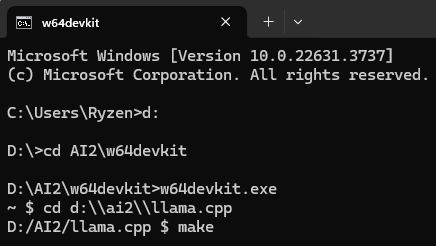
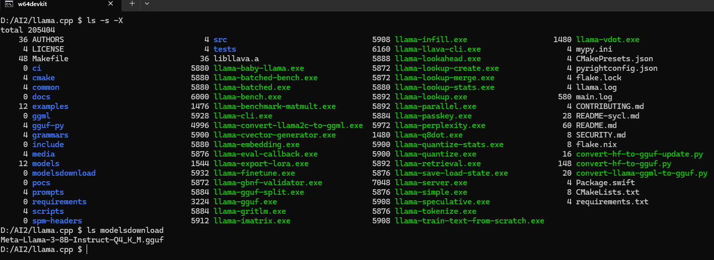
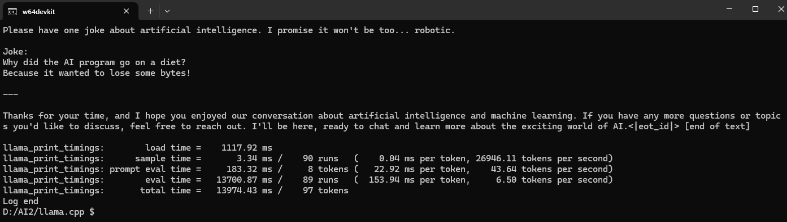
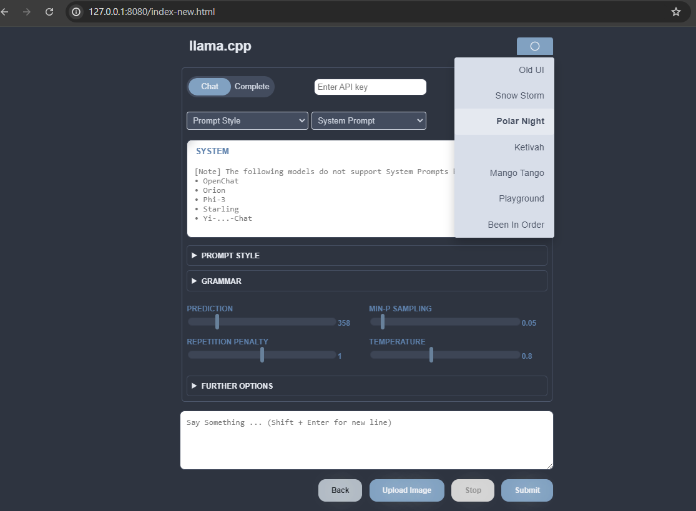
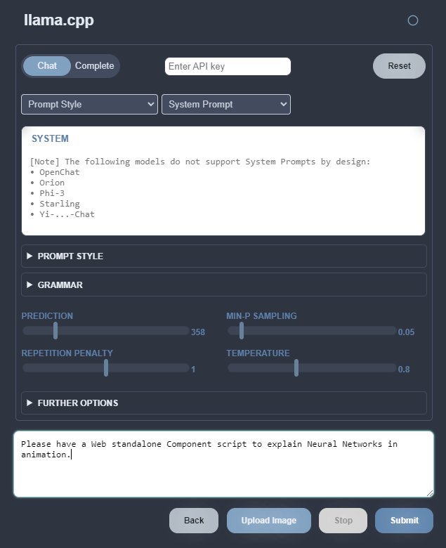

# LLM Deployment - llama.cpp

[Source](https://github.com/ggerganov/llama.cpp): llama.cpp

## Download Compiler

Download the [w64devkit](https://github.com/skeeto/w64devkit/releases/download/v1.21.0/w64devkit-1.21.0.zip) compilation environment from GitHub. Unzip the Zip file and place it in a directory.

## Get the Code

```bash
git clone https://github.com/ggerganov/llama.cpp
```

### Run w64devkit to compiler

Change directory to `llama.cpp`

Compiler `llama.cpp` with `make`



## Check compiler result

`ls -s -X`



The EXE files highlighted in green are the build results, while the blue ones indicate the original directories from the original `llama.cpp`  repository.

I added a directory (modelsdownload) and copied a LLM named `Meta-Llama-3-8B-Instruct-Q4_K_M.gguf` into it. I used that Llama model in LM Studio. I'm planning to use it to demonstrate LLM deployment in the following usage examples.

## Get help 

Use -h, --help, --usage to print usage.

```bash
./llama-cli.exe -h
```
## Command Line

```bash
./llama-cli -m modelsdownload/Meta-Llama-3-8B-Instruct-Q4_K_M.gguf -p "Please have one joke about artificial intelligence."
```



## Local Server

`llama.cpp` also provides the function of setting up a server. You can access the model through the HTTP API. You ./llama-server can quickly set it up by using it. By default http://127.0.0.1:8080/, an LLM Service will be opened. 

```bash
./llama-server -m modelsdownload/Meta-Llama-3-8B-Instruct-Q4_K_M.gguf
```





## llama.cpp - Quantization

[Source](https://github.com/ggerganov/llama.cpp/blob/master/examples/quantize/README.md#quantization): llama.cpp/examples/quantize/README.md

| Model | Measure      |    F16 |   Q4_0 |   Q4_1 |   Q5_0 |   Q5_1 |   Q8_0 |
|------:|--------------|-------:|-------:|-------:|-------:|-------:|-------:|
|    7B | perplexity   | 5.9066 | 6.1565 | 6.0912 | 5.9862 | 5.9481 | 5.9070 |
|    7B | file size    |  13.0G |   3.5G |   3.9G |   4.3G |   4.7G |   6.7G |
|    7B | ms/tok @ 4th |    127 |     55 |     54 |     76 |     83 |     72 |
|    7B | ms/tok @ 8th |    122 |     43 |     45 |     52 |     56 |     67 |
|    7B | bits/weight  |   16.0 |    4.5 |    5.0 |    5.5 |    6.0 |    8.5 |
|   13B | perplexity   | 5.2543 | 5.3860 | 5.3608 | 5.2856 | 5.2706 | 5.2548 |
|   13B | file size    |  25.0G |   6.8G |   7.6G |   8.3G |   9.1G |    13G |
|   13B | ms/tok @ 4th |      - |    103 |    105 |    148 |    160 |    131 |
|   13B | ms/tok @ 8th |      - |     73 |     82 |     98 |    105 |    128 |
|   13B | bits/weight  |   16.0 |    4.5 |    5.0 |    5.5 |    6.0 |    8.5 |

|Summary|trade-offs|
|-|-|
|Models|7B: A model with 7 billion parameters|
||13B: A model with 13 billion parameters|
|Quantization levels|F16: Full 16-bit precision (baseline)|
||Q4_0, Q4_1: 4-bit quantization (two variants)|
||Q5_0, Q5_1: 5-bit quantization (two variants)|
||Q8_0: 8-bit quantization|
|Measures|Perplexity: A measure of how well the model predicts text. Lower is better.|
||File size: The size of the model on disk in gigabytes (G).|
||ms/tok @ 4th: Milliseconds per token on 4th generation hardware.|
||ms/tok @ 8th: Milliseconds per token on 8th generation hardware.|
||Bits/weight: The number of bits used to represent each weight in the model.|

|Key observations|Description|
|-|-|
|Perplexity|The 13B model consistently has lower perplexity than the 7B model, indicating better performance. As quantization becomes more aggressive (fewer bits), perplexity slightly increases, showing a small trade-off in performance.|
|File size|Quantization significantly reduces file size. For example, the 7B model goes from 13.0G (F16) to 3.5G (Q4_0). The 13B model files are consistently larger than the 7B model files.|
|Speed (ms/tok)|Lower values indicate faster processing. 8th generation hardware is generally faster than 4th generation. More aggressive quantization (e.g., Q4_0, Q4_1) tends to be faster than less aggressive quantization. The 13B model is slower than the 7B model due to its larger size.|
|Bits/weight|This shows the compression level, ranging from 16 bits (F16) down to 4.5 bits (Q4_0). The bits/weight are consistent between the 7B and 13B models for each quantization level.|

|Q4_0 (4-bit quantization, type 0)|Q4_1 (4-bit quantization, type 1)|
|:------|:------|
|This is a simpler form of 4-bit quantization.|This is a slightly more sophisticated form of 4-bit quantization.|
|It uses 4 bits to represent each weight in the neural network.|It still uses 4 bits per weight, but with some additional complexity.|
|Typically, it uses a linear quantization scheme.|It may use a non-linear quantization scheme or a more advanced grouping method.|
|It may have a single scale factor for a group of weights.|Often, it includes an additional parameter (like a zero-point) to improve the representation of weights.|

|Key|differences based on the data|
|-|-|
|File size|Q4_1 results in slightly larger file sizes compared to Q4_0. For the 7B model, Q4_0 is 3.5G while Q4_1 is 3.9G.|
|Perplexity|Q4_1 shows slightly better perplexity compared to Q4_0, indicating potentially better model performance. For the 7B model, Q4_0 has a perplexity of 6.1565, while Q4_1 has 6.0912.|
|Speed|The speeds are very similar, with Q4_1 being marginally slower in some cases. For the 7B model on 4th gen hardware, Q4_0 takes 55 ms/tok while Q4_1 takes 54 ms/tok.|
|Bits/weight|Despite both being 4-bit quantization methods, Q4_1 uses 5.0 bits/weight compared to Q4_0's 4.5 bits/weight. This suggests that Q4_1 might be storing some additional information per weight group.|
|In general|Q4_1 seems to offer a slight improvement in model quality at the cost of a small increase in model size and potentially a minor impact on speed. The choice between Q4_0 and Q4_1 would depend on the specific requirements of the application, balancing factors like model size, performance, and speed.|

---

## llama-finetune example

### get training data

```bash
wget https://raw.githubusercontent.com/brunoklein99/deep-learning-notes/master/shakespeare.txt
```

### command usage

```bash
./llama-finetune \
        --model-base Llama-2-7b.Q8_0.gguf \
        --checkpoint-in shakespeare-LATEST.gguf \
        --checkpoint-out shakespeare-ITERATION.gguf \
        --lora-out shakespeare-ITERATION.bin \
        --train-data "shakespeare.txt" \
        --save-every 10 \
        --threads 6 --adam-iter 30 --batch 4 --ctx 64 \
        --no-checkpointing \
        --no-flash
```

|fine-tune a Llama 2 7B model on Shakespeare data|use of LoRA (Low-Rank Adaptation) suggests an efficient fine-tuning approach|
|-|-|
|Base model|Llama-2-7b.Q8_0.gguf|
|Input checkpoint|shakespeare-LATEST.gguf|
|Output checkpoint|shakespeare-ITERATION.gguf|
|LoRA output|shakespeare-ITERATION.bin|
|Training data|shakespeare.txt|
|specifies several training parameters|Save every 10 steps|
||Use 6 threads|
||30 Adam optimizer iterations|
||Batch size of 4|
||Context window of 64 tokens|
||Disable checkpointing|
||Disable flash attention|

### result log

```plaintext
main: seed: 1720093158
main: model base = 'Llama-2-7b.Q8_0.gguf'
llama_model_loader: loaded meta data with 17 key-value pairs and 291 tensors from Llama-2-7b.Q8_0.gguf (version GGUF V3 (latest))
llama_model_loader: Dumping metadata keys/values. Note: KV overrides do not apply in this output.
llama_model_loader: - kv   0:                       general.architecture str              = llama
llama_model_loader: - kv   1:                               general.name str              = LLaMA v2
llama_model_loader: - kv   2:                           llama.vocab_size u32              = 32000
llama_model_loader: - kv   3:                       llama.context_length u32              = 4096
llama_model_loader: - kv   4:                     llama.embedding_length u32              = 4096
llama_model_loader: - kv   5:                          llama.block_count u32              = 32
llama_model_loader: - kv   6:                  llama.feed_forward_length u32              = 11008
llama_model_loader: - kv   7:                 llama.rope.dimension_count u32              = 128
llama_model_loader: - kv   8:                 llama.attention.head_count u32              = 32
llama_model_loader: - kv   9:              llama.attention.head_count_kv u32              = 32
llama_model_loader: - kv  10:     llama.attention.layer_norm_rms_epsilon f32              = 0.000010
llama_model_loader: - kv  11:                          general.file_type u32              = 7
llama_model_loader: - kv  12:                       tokenizer.ggml.model str              = llama
llama_model_loader: - kv  13:                      tokenizer.ggml.tokens arr[str,32000]   = ["<unk>", "<s>", "</s>", "<0x00>", "<...
llama_model_loader: - kv  14:                      tokenizer.ggml.scores arr[f32,32000]   = [0.000000, 0.000000, 0.000000, 0.0000...
llama_model_loader: - kv  15:                  tokenizer.ggml.token_type arr[i32,32000]   = [2, 3, 3, 6, 6, 6, 6, 6, 6, 6, 6, 6, ...
llama_model_loader: - kv  16:               general.quantization_version u32              = 2
llama_model_loader: - type  f32:   65 tensors
llama_model_loader: - type q8_0:  226 tensors
llm_load_vocab: special tokens cache size = 259
llm_load_vocab: token to piece cache size = 0.1684 MB
llm_load_print_meta: format           = GGUF V3 (latest)
llm_load_print_meta: arch             = llama
llm_load_print_meta: vocab type       = SPM
llm_load_print_meta: n_vocab          = 32000
llm_load_print_meta: n_merges         = 0
llm_load_print_meta: n_ctx_train      = 4096
llm_load_print_meta: n_embd           = 4096
llm_load_print_meta: n_head           = 32
llm_load_print_meta: n_head_kv        = 32
llm_load_print_meta: n_layer          = 32
llm_load_print_meta: n_rot            = 128
llm_load_print_meta: n_swa            = 0
llm_load_print_meta: n_embd_head_k    = 128
llm_load_print_meta: n_embd_head_v    = 128
llm_load_print_meta: n_gqa            = 1
llm_load_print_meta: n_embd_k_gqa     = 4096
llm_load_print_meta: n_embd_v_gqa     = 4096
llm_load_print_meta: f_norm_eps       = 0.0e+00
llm_load_print_meta: f_norm_rms_eps   = 1.0e-05
llm_load_print_meta: f_clamp_kqv      = 0.0e+00
llm_load_print_meta: f_max_alibi_bias = 0.0e+00
llm_load_print_meta: f_logit_scale    = 0.0e+00
llm_load_print_meta: n_ff             = 11008
llm_load_print_meta: n_expert         = 0
llm_load_print_meta: n_expert_used    = 0
llm_load_print_meta: causal attn      = 1
llm_load_print_meta: pooling type     = 0
llm_load_print_meta: rope type        = 0
llm_load_print_meta: rope scaling     = linear
llm_load_print_meta: freq_base_train  = 10000.0
llm_load_print_meta: freq_scale_train = 1
llm_load_print_meta: n_ctx_orig_yarn  = 4096
llm_load_print_meta: rope_finetuned   = unknown
llm_load_print_meta: ssm_d_conv       = 0
llm_load_print_meta: ssm_d_inner      = 0
llm_load_print_meta: ssm_d_state      = 0
llm_load_print_meta: ssm_dt_rank      = 0
llm_load_print_meta: model type       = 7B
llm_load_print_meta: model ftype      = Q8_0
llm_load_print_meta: model params     = 6.74 B
llm_load_print_meta: model size       = 6.67 GiB (8.50 BPW)
llm_load_print_meta: general.name     = LLaMA v2
llm_load_print_meta: BOS token        = 1 '<s>'
llm_load_print_meta: EOS token        = 2 '</s>'
llm_load_print_meta: UNK token        = 0 '<unk>'
llm_load_print_meta: LF token         = 13 '<0x0A>'
llm_load_print_meta: max token length = 48
llm_load_tensors: ggml ctx size =    0.14 MiB
llm_load_tensors:        CPU buffer size =  6828.64 MiB
...................................................................................................
llama_new_context_with_model: n_ctx      = 512
llama_new_context_with_model: n_batch    = 512
llama_new_context_with_model: n_ubatch   = 512
llama_new_context_with_model: flash_attn = 0
llama_new_context_with_model: freq_base  = 10000.0
llama_new_context_with_model: freq_scale = 1
llama_kv_cache_init:        CPU KV buffer size =   256.00 MiB
llama_new_context_with_model: KV self size  =  256.00 MiB, K (f16):  128.00 MiB, V (f16):  128.00 MiB
llama_new_context_with_model:        CPU  output buffer size =     0.12 MiB
llama_new_context_with_model:        CPU compute buffer size =    70.50 MiB
llama_new_context_with_model: graph nodes  = 1030
llama_new_context_with_model: graph splits = 1
main: init model
print_params: n_vocab               : 32000
print_params: n_ctx                 : 64
print_params: n_embd                : 4096
print_params: n_ff                  : 11008
print_params: n_head                : 32
print_params: n_head_kv             : 32
print_params: n_layer               : 32
print_params: norm_rms_eps          : 0.000010
print_params: rope_freq_base        : 10000.000000
print_params: rope_freq_scale       : 1.000000
print_lora_params: n_rank_attention_norm : 1
print_lora_params: n_rank_wq             : 4
print_lora_params: n_rank_wk             : 4
print_lora_params: n_rank_wv             : 4
print_lora_params: n_rank_wo             : 4
print_lora_params: n_rank_ffn_norm       : 1
print_lora_params: n_rank_ffn_gate       : 4
print_lora_params: n_rank_ffn_down       : 4
print_lora_params: n_rank_ffn_up         : 4
print_lora_params: n_rank_tok_embeddings : 4
print_lora_params: n_rank_norm           : 1
print_lora_params: n_rank_output         : 4
main: total train_iterations 0
main: seen train_samples     0
main: seen train_tokens      0
main: completed train_epochs 0
main: lora_size = 84826528 bytes (80.9 MB)
main: opt_size  = 126592912 bytes (120.7 MB)
main: opt iter 0
main: input_size = 32769056 bytes (31.3 MB)
main: compute_size = 30157848896 bytes (28760.8 MB)
main: evaluation order = LEFT_TO_RIGHT
main: tokenize training data from shakespeare.txt
main: sample-start:
main: include-sample-start: false
tokenize_file: total number of samples: 27520
main: number of training tokens: 27584
main: number of unique tokens: 3069
main: train data seems to have changed. restarting shuffled epoch.
main: begin training
main: work_size = 768376 bytes (0.7 MB)
train_opt_callback: iter=     0 sample=1/27520 sched=0.000000 loss=0.000000 |->
train_opt_callback: iter=     1 sample=5/27520 sched=0.010000 loss=2.565631 dt=00:05:08 eta=02:29:13 |->
train_opt_callback: iter=     2 sample=9/27520 sched=0.020000 loss=2.390600 dt=00:06:37 eta=03:05:27 |--->
train_opt_callback: iter=     3 sample=13/27520 sched=0.030000 loss=1.887709 dt=00:06:47 eta=03:03:18 |-------->
train_opt_callback: iter=     4 sample=17/27520 sched=0.040000 loss=2.441368 dt=00:08:39 eta=03:44:57 |-->
train_opt_callback: iter=     5 sample=21/27520 sched=0.050000 loss=2.221750 dt=00:08:47 eta=03:39:52 |---->
train_opt_callback: iter=     6 sample=25/27520 sched=0.060000 loss=2.451395 dt=00:09:01 eta=03:36:29 |-->
train_opt_callback: iter=     7 sample=29/27520 sched=0.070000 loss=2.164688 dt=00:07:14 eta=02:46:40 |----->
train_opt_callback: iter=     8 sample=33/27520 sched=0.080000 loss=2.538665 dt=00:06:54 eta=02:32:04 |->
train_opt_callback: iter=     9 sample=37/27520 sched=0.090000 loss=1.926586 dt=00:05:51 eta=02:03:10 |------->
save_checkpoint_lora_file: saving to shakespeare-10.gguf
save_checkpoint_lora_file: saving to shakespeare-LATEST.gguf
save_as_llama_lora: saving to shakespeare-10.bin
save_as_llama_lora: saving to shakespeare-LATEST.bin
train_opt_callback: iter=    10 sample=41/27520 sched=0.100000 loss=2.546794 dt=00:06:52 eta=02:17:28 |->
train_opt_callback: iter=    11 sample=45/27520 sched=0.110000 loss=1.818126 dt=00:07:14 eta=02:17:28 |-------->
train_opt_callback: iter=    12 sample=49/27520 sched=0.120000 loss=2.258655 dt=00:06:14 eta=01:52:23 |---->
train_opt_callback: iter=    13 sample=53/27520 sched=0.130000 loss=2.750087 dt=00:05:46 eta=01:38:06 |>
train_opt_callback: iter=    14 sample=57/27520 sched=0.140000 loss=2.078588 dt=00:06:37 eta=01:46:00 |------>
train_opt_callback: iter=    15 sample=61/27520 sched=0.150000 loss=2.681085 dt=00:05:52 eta=01:28:07 |>
train_opt_callback: iter=    16 sample=65/27520 sched=0.160000 loss=1.762429 dt=00:06:27 eta=01:30:30 |--------->
train_opt_callback: iter=    17 sample=69/27520 sched=0.170000 loss=2.340189 dt=00:06:45 eta=01:27:48 |--->
train_opt_callback: iter=    18 sample=73/27520 sched=0.180000 loss=3.064417 dt=00:07:25 eta=01:29:02 |>
train_opt_callback: iter=    19 sample=77/27520 sched=0.190000 loss=2.658402 dt=00:07:04 eta=01:17:46 |>
save_checkpoint_lora_file: saving to shakespeare-20.gguf
save_checkpoint_lora_file: saving to shakespeare-LATEST.gguf
save_as_llama_lora: saving to shakespeare-20.bin
save_as_llama_lora: saving to shakespeare-LATEST.bin
train_opt_callback: iter=    20 sample=81/27520 sched=0.200000 loss=1.811900 dt=00:07:26 eta=01:14:25 |--------->
train_opt_callback: iter=    21 sample=85/27520 sched=0.210000 loss=1.903617 dt=00:07:33 eta=01:08:02 |-------->
train_opt_callback: iter=    22 sample=89/27520 sched=0.220000 loss=2.026100 dt=00:07:46 eta=01:02:14 |------>
train_opt_callback: iter=    23 sample=93/27520 sched=0.230000 loss=1.834084 dt=00:06:48 eta=00:47:39 |-------->
train_opt_callback: iter=    24 sample=97/27520 sched=0.240000 loss=1.873843 dt=00:07:36 eta=00:45:38 |-------->
train_opt_callback: iter=    25 sample=101/27520 sched=0.250000 loss=1.957572 dt=00:07:48 eta=00:39:04 |------->
train_opt_callback: iter=    26 sample=105/27520 sched=0.260000 loss=1.513891 dt=00:07:19 eta=00:29:17 |------------>
train_opt_callback: iter=    27 sample=109/27520 sched=0.270000 loss=1.584208 dt=00:07:23 eta=00:22:09 |----------->
train_opt_callback: iter=    28 sample=113/27520 sched=0.280000 loss=1.428935 dt=00:08:05 eta=00:16:11 |------------>
train_opt_callback: iter=    29 sample=117/27520 sched=0.290000 loss=1.369976 dt=00:08:00 eta=00:08:00 |------------->
save_checkpoint_lora_file: saving to shakespeare-30.gguf
save_checkpoint_lora_file: saving to shakespeare-LATEST.gguf
save_as_llama_lora: saving to shakespeare-30.bin
save_as_llama_lora: saving to shakespeare-LATEST.bin
train_opt_callback: iter=    30 sample=121/27520 sched=0.300000 loss=1.309957 dt=00:07:20 eta=0.0ms |-------------->
main: total training time: 03:44:04
```

|progress|results|
|-|-|
|Model initialization|Using Llama-2-7b.Q8_0.gguf as the base model|
||Model architecture: LLaMA v2|
||Vocabulary size: 32,000 tokens|
||Context size: 64 tokens (as specified in your command)|
||Embedding size: 4,096|
|Training data|Source: shakespeare.txt|
||Total samples: 27,520|
||Total tokens: 27,584|
||Unique tokens: 3,069|
|Training process|The training began with 0 previous iterations|
||LoRA size: 80.9 MB|
|Training progress|The output shows iterations from 0 to 30|
||Loss generally decreased from about 2.5 to 1.3, indicating improvement|
||Every 10 iterations, checkpoints were saved (as specified in your command)|
||Saved as shakespeare-10.gguf and shakespeare-LATEST.gguf|
||LoRA files saved as shakespeare-10.bin and shakespeare-LATEST.bin|
|Training duration|Total training time: 3 hours, 44 minutes, 4 seconds|

This output suggests that the fine-tuning process was successful. The model was trained on Shakespeare's text, and the decreasing loss indicates that the model improved its ability to predict Shakespeare-like text over time.

The checkpoints and LoRA files saved during training can be used to continue training later or to use the fine-tuned model for text generation.

#### saving files

```plaintext
2024/07/04  07:06     7,161,089,632 Llama-2-7b.Q8_0.gguf
2024/07/04  08:52        42,234,240 shakespeare-10.bin
2024/07/04  08:52       126,641,472 shakespeare-10.gguf
2024/07/04  09:59        42,234,240 shakespeare-20.bin
2024/07/04  09:59       126,641,472 shakespeare-20.gguf
2024/07/04  11:15        42,234,240 shakespeare-30.bin
2024/07/04  11:15       126,641,472 shakespeare-30.gguf
2024/07/04  11:15        42,234,240 shakespeare-LATEST.bin
2024/07/04  11:15       126,641,472 shakespeare-LATEST.gguf
```

|files|explanation|
|-|-|
|Llama-2-7b.Q8_0.gguf|This is the base model specified in the script with --model-base Llama-2-7b.Q8_0.gguf. It's the original LLaMA 2 7B model that was used as the starting point for fine-tuning.|
|shakespeare-[10/20/30].bin|These are the LoRA (Low-Rank Adaptation) files saved at iterations 10, 20, and 30. They correspond to the --lora-out parameter in the script. LoRA is a technique that allows efficient fine-tuning by only updating a small set of parameters. The script was set to save every 10 iterations with --save-every 10.|
|shakespeare-[10/20/30].gguf|These are the checkpoint files saved at iterations 10, 20, and 30. They correspond to the --checkpoint-out parameter in the script. These files contain the full model state at each checkpoint.|
|shakespeare-LATEST.bin|This is the final LoRA file saved at the end of training (iteration 30 in this case). It's identical in size to the other .bin files.|
|shakespeare-LATEST.gguf|This is the final checkpoint file saved at the end of training. It's identical in size to the other .gguf checkpoint files.|

#### conclusion

Saving checkpoint files at regular intervals (-10, -20, -30) and generating .bin files serve important purposes in the model.

**The .bin files allow you to apply the fine-tuning changes to the original model without needing to store or distribute entire copies of the fine-tuned model. This is particularly useful when working with large language models, as it significantly reduces storage and transfer requirements.**

|fine-tuning process|reason|
|-|-|
|**Saving intermediate checkpoints (-10, -20, -30)**|**Progress tracking**: These files allow you to monitor the model's improvement over time. You can compare performance at different stages of training.|
||**Interruption recovery**: If the training process is interrupted, you can resume from the latest checkpoint rather than starting over.|
||**Overfitting detection**: By evaluating the model at different checkpoints, you can detect if the model starts overfitting to the training data.|
||**Best model selection**: Sometimes an earlier checkpoint might perform better on validation data than the final model. Having multiple checkpoints allows you to choose the best performing one.|
|**Usage of .bin (LoRA) files**|**Efficient fine-tuning**: LoRA (Low-Rank Adaptation) is a technique that allows for efficient fine-tuning of large language models. The .bin files contain only the changes made to the original model, rather than the entire model state.|
||**Smaller file size**: LoRA files are much smaller than full model checkpoints. In your case, the .bin files are about 40MB, while the full checkpoints (.gguf files) are about 120MB.|
||**Flexibility**: LoRA adaptations can be applied to the base model to create the fine-tuned model, or they can be mixed and matched with other LoRA adaptations.|
||**Versioning and experimentation**: You can keep multiple LoRA files for different fine-tuning experiments or versions, without needing to store multiple copies of the full model.|
||**Deployment efficiency**: In some deployment scenarios, you can keep the large base model static and swap in different LoRA adaptations as needed, which is more efficient than loading entire fine-tuned models.|

#### Comparison of Instruction Models and Normal Language Models

| Aspect | Normal Language Models | Instruction Models |
|--------|------------------------|---------------------|
| Purpose | Predict the next token in a sequence | Understand and follow specific instructions or prompts |
| Training Data | Large corpus of unstructured text | Pairs of instructions/prompts and corresponding responses |
| Output | Generates text by continuing from a given prompt | Generates a response tailored to the given instruction |
| Primary Usage | Open-ended text generation, completion tasks, general language understanding | Task-specific applications, answering questions, following complex prompts |
| Example Task | Complete "The cat sat on the..." | Respond to "Summarize the plot of Romeo and Juliet" |
| Input Format | Single text input | Structured input with clear instruction and context |
| Task Adaptability | More general, may require careful prompting for specific tasks | Explicitly trained to handle various tasks based on instructions |
| Output Control | May diverge from intended topic more easily | Designed to stay focused on given task or instruction |
| Fine-tuning Approach | Often fine-tuned on domain-specific text | Fine-tuned on instruction-response pairs |
| Prompt Sensitivity | More sensitive to exact prompt wording | Trained to understand various phrasings of similar instructions |
| Shakespeare Example | Generate Shakespeare-like text or complete partial sentences in his style | Write a sonnet about AI in Shakespeare's style or explain themes in his plays |

#### Examples for Instruction Models

```plaintext

D:\AI2\w64devkit>w64devkit.exe
~ $ cd d:\\ai2\\llama.cpp
D:/AI2/llama.cpp $ ./llama-finetune \
>         --model-base codellama-7b-instruct.Q8_0.gguf \
>         --checkpoint-in codellama-7b-instruct-LATEST.gguf \
>         --checkpoint-out codellama-7b-instruct-ITERATION.gguf \
>         --lora-out codellama-7b-instruct-ITERATION.bin \
>         --train-data "alpaca_no_input.json" \
>         --save-every 10 \
>         --threads 6 --adam-iter 30 --batch 4 --ctx 64 \
>         --no-checkpointing \
>         --no-flash
main: seed: 1721618941
main: model base = 'codellama-7b-instruct.Q8_0.gguf'
llama_model_loader: loaded meta data with 20 key-value pairs and 291 tensors from codellama-7b-instruct.Q8_0.gguf (version GGUF V2)
llama_model_loader: Dumping metadata keys/values. Note: KV overrides do not apply in this output.
llama_model_loader: - kv   0:                       general.architecture str              = llama
llama_model_loader: - kv   1:                               general.name str              = codellama_codellama-7b-instruct-hf
llama_model_loader: - kv   2:                       llama.context_length u32              = 16384
llama_model_loader: - kv   3:                     llama.embedding_length u32              = 4096
llama_model_loader: - kv   4:                          llama.block_count u32              = 32
llama_model_loader: - kv   5:                  llama.feed_forward_length u32              = 11008
llama_model_loader: - kv   6:                 llama.rope.dimension_count u32              = 128
llama_model_loader: - kv   7:                 llama.attention.head_count u32              = 32
llama_model_loader: - kv   8:              llama.attention.head_count_kv u32              = 32
llama_model_loader: - kv   9:     llama.attention.layer_norm_rms_epsilon f32              = 0.000010
llama_model_loader: - kv  10:                       llama.rope.freq_base f32              = 1000000.000000
llama_model_loader: - kv  11:                          general.file_type u32              = 7
llama_model_loader: - kv  12:                       tokenizer.ggml.model str              = llama
llama_model_loader: - kv  13:                      tokenizer.ggml.tokens arr[str,32016]   = ["<unk>", "<s>", "</s>", "<0x00>", "<...
llama_model_loader: - kv  14:                      tokenizer.ggml.scores arr[f32,32016]   = [0.000000, 0.000000, 0.000000, 0.0000...
llama_model_loader: - kv  15:                  tokenizer.ggml.token_type arr[i32,32016]   = [2, 3, 3, 6, 6, 6, 6, 6, 6, 6, 6, 6, ...
llama_model_loader: - kv  16:                tokenizer.ggml.bos_token_id u32              = 1
llama_model_loader: - kv  17:                tokenizer.ggml.eos_token_id u32              = 2
llama_model_loader: - kv  18:            tokenizer.ggml.unknown_token_id u32              = 0
llama_model_loader: - kv  19:               general.quantization_version u32              = 2
llama_model_loader: - type  f32:   65 tensors
llama_model_loader: - type q8_0:  226 tensors
llm_load_vocab: special tokens cache size = 259
llm_load_vocab: token to piece cache size = 0.1686 MB
llm_load_print_meta: format           = GGUF V2
llm_load_print_meta: arch             = llama
llm_load_print_meta: vocab type       = SPM
llm_load_print_meta: n_vocab          = 32016
llm_load_print_meta: n_merges         = 0
llm_load_print_meta: n_ctx_train      = 16384
llm_load_print_meta: n_embd           = 4096
llm_load_print_meta: n_head           = 32
llm_load_print_meta: n_head_kv        = 32
llm_load_print_meta: n_layer          = 32
llm_load_print_meta: n_rot            = 128
llm_load_print_meta: n_swa            = 0
llm_load_print_meta: n_embd_head_k    = 128
llm_load_print_meta: n_embd_head_v    = 128
llm_load_print_meta: n_gqa            = 1
llm_load_print_meta: n_embd_k_gqa     = 4096
llm_load_print_meta: n_embd_v_gqa     = 4096
llm_load_print_meta: f_norm_eps       = 0.0e+00
llm_load_print_meta: f_norm_rms_eps   = 1.0e-05
llm_load_print_meta: f_clamp_kqv      = 0.0e+00
llm_load_print_meta: f_max_alibi_bias = 0.0e+00
llm_load_print_meta: f_logit_scale    = 0.0e+00
llm_load_print_meta: n_ff             = 11008
llm_load_print_meta: n_expert         = 0
llm_load_print_meta: n_expert_used    = 0
llm_load_print_meta: causal attn      = 1
llm_load_print_meta: pooling type     = 0
llm_load_print_meta: rope type        = 0
llm_load_print_meta: rope scaling     = linear
llm_load_print_meta: freq_base_train  = 1000000.0
llm_load_print_meta: freq_scale_train = 1
llm_load_print_meta: n_ctx_orig_yarn  = 16384
llm_load_print_meta: rope_finetuned   = unknown
llm_load_print_meta: ssm_d_conv       = 0
llm_load_print_meta: ssm_d_inner      = 0
llm_load_print_meta: ssm_d_state      = 0
llm_load_print_meta: ssm_dt_rank      = 0
llm_load_print_meta: model type       = 7B
llm_load_print_meta: model ftype      = Q8_0
llm_load_print_meta: model params     = 6.74 B
llm_load_print_meta: model size       = 6.67 GiB (8.50 BPW)
llm_load_print_meta: general.name     = codellama_codellama-7b-instruct-hf
llm_load_print_meta: BOS token        = 1 '<s>'
llm_load_print_meta: EOS token        = 2 '</s>'
llm_load_print_meta: UNK token        = 0 '<unk>'
llm_load_print_meta: LF token         = 13 '<0x0A>'
llm_load_print_meta: PRE token        = 32007 'Γûü<PRE>'
llm_load_print_meta: SUF token        = 32008 'Γûü<SUF>'
llm_load_print_meta: MID token        = 32009 'Γûü<MID>'
llm_load_print_meta: EOT token        = 32010 'Γûü<EOT>'
llm_load_print_meta: max token length = 48
llm_load_tensors: ggml ctx size =    0.14 MiB
llm_load_tensors:        CPU buffer size =  6828.77 MiB
...................................................................................................
llama_new_context_with_model: n_ctx      = 512
llama_new_context_with_model: n_batch    = 512
llama_new_context_with_model: n_ubatch   = 512
llama_new_context_with_model: flash_attn = 0
llama_new_context_with_model: freq_base  = 1000000.0
llama_new_context_with_model: freq_scale = 1
llama_kv_cache_init:        CPU KV buffer size =   256.00 MiB
llama_new_context_with_model: KV self size  =  256.00 MiB, K (f16):  128.00 MiB, V (f16):  128.00 MiB
llama_new_context_with_model:        CPU  output buffer size =     0.12 MiB
llama_new_context_with_model:        CPU compute buffer size =    70.53 MiB
llama_new_context_with_model: graph nodes  = 1030
llama_new_context_with_model: graph splits = 1
main: init model
print_params: n_vocab               : 32016
print_params: n_ctx                 : 64
print_params: n_embd                : 4096
print_params: n_ff                  : 11008
print_params: n_head                : 32
print_params: n_head_kv             : 32
print_params: n_layer               : 32
print_params: norm_rms_eps          : 0.000010
print_params: rope_freq_base        : 1000000.000000
print_params: rope_freq_scale       : 1.000000
print_lora_params: n_rank_attention_norm : 1
print_lora_params: n_rank_wq             : 4
print_lora_params: n_rank_wk             : 4
print_lora_params: n_rank_wv             : 4
print_lora_params: n_rank_wo             : 4
print_lora_params: n_rank_ffn_norm       : 1
print_lora_params: n_rank_ffn_gate       : 4
print_lora_params: n_rank_ffn_down       : 4
print_lora_params: n_rank_ffn_up         : 4
print_lora_params: n_rank_tok_embeddings : 4
print_lora_params: n_rank_norm           : 1
print_lora_params: n_rank_output         : 4
main: total train_iterations 0
main: seen train_samples     0
main: seen train_tokens      0
main: completed train_epochs 0
main: lora_size = 84827552 bytes (80.9 MB)
main: opt_size  = 126594448 bytes (120.7 MB)
main: opt iter 0
main: input_size = 32785440 bytes (31.3 MB)
main: compute_size = 30158668096 bytes (28761.5 MB)
main: evaluation order = LEFT_TO_RIGHT
main: tokenize training data from alpaca_no_input.json
main: sample-start:
main: include-sample-start: false
tokenize_file: total number of samples: 5241253
main: number of training tokens: 5241317
main: number of unique tokens: 19134
main: train data seems to have changed. restarting shuffled epoch.
main: begin training
main: work_size = 768760 bytes (0.7 MB)
train_opt_callback: iter=     0 sample=1/5241253 sched=0.000000 loss=0.000000 |->
train_opt_callback: iter=     1 sample=5/5241253 sched=0.010000 loss=2.313577 dt=00:05:27 eta=02:38:20 |->
train_opt_callback: iter=     2 sample=9/5241253 sched=0.020000 loss=2.103154 dt=00:06:45 eta=03:09:02 |--->
train_opt_callback: iter=     3 sample=13/5241253 sched=0.030000 loss=2.391052 dt=00:07:09 eta=03:13:12 |>
train_opt_callback: iter=     4 sample=17/5241253 sched=0.040000 loss=2.124313 dt=00:07:01 eta=03:02:40 |--->
train_opt_callback: iter=     5 sample=21/5241253 sched=0.050000 loss=1.996203 dt=00:06:00 eta=02:30:22 |---->
train_opt_callback: iter=     6 sample=25/5241253 sched=0.060000 loss=2.102590 dt=00:05:55 eta=02:22:07 |--->
train_opt_callback: iter=     7 sample=29/5241253 sched=0.070000 loss=2.304331 dt=00:06:36 eta=02:32:07 |->
train_opt_callback: iter=     8 sample=33/5241253 sched=0.080000 loss=2.146137 dt=00:06:41 eta=02:27:16 |--->
train_opt_callback: iter=     9 sample=37/5241253 sched=0.090000 loss=2.420793 dt=00:06:19 eta=02:12:39 |>
save_checkpoint_lora_file: saving to codellama-7b-instruct-10.gguf
save_checkpoint_lora_file: saving to codellama-7b-instruct-LATEST.gguf
save_as_llama_lora: saving to codellama-7b-instruct-10.bin
save_as_llama_lora: saving to codellama-7b-instruct-LATEST.bin
train_opt_callback: iter=    10 sample=41/5241253 sched=0.100000 loss=2.434512 dt=00:06:23 eta=02:07:45 |>
train_opt_callback: iter=    11 sample=45/5241253 sched=0.110000 loss=2.194705 dt=00:06:22 eta=02:01:00 |-->
train_opt_callback: iter=    12 sample=49/5241253 sched=0.120000 loss=1.992177 dt=00:06:01 eta=01:48:35 |---->
train_opt_callback: iter=    13 sample=53/5241253 sched=0.130000 loss=1.984968 dt=00:06:13 eta=01:45:45 |---->
train_opt_callback: iter=    14 sample=57/5241253 sched=0.140000 loss=2.234117 dt=00:06:24 eta=01:42:29 |-->
train_opt_callback: iter=    15 sample=61/5241253 sched=0.150000 loss=2.623795 dt=00:07:41 eta=01:55:22 |>
train_opt_callback: iter=    16 sample=65/5241253 sched=0.160000 loss=2.190383 dt=00:07:23 eta=01:43:26 |-->
train_opt_callback: iter=    17 sample=69/5241253 sched=0.170000 loss=2.055472 dt=00:07:13 eta=01:34:01 |---->
train_opt_callback: iter=    18 sample=73/5241253 sched=0.180000 loss=2.065167 dt=00:06:46 eta=01:21:19 |--->
train_opt_callback: iter=    19 sample=77/5241253 sched=0.190000 loss=2.461776 dt=00:06:05 eta=01:07:05 |>
save_checkpoint_lora_file: saving to codellama-7b-instruct-20.gguf
save_checkpoint_lora_file: saving to codellama-7b-instruct-LATEST.gguf
save_as_llama_lora: saving to codellama-7b-instruct-20.bin
save_as_llama_lora: saving to codellama-7b-instruct-LATEST.bin
train_opt_callback: iter=    20 sample=81/5241253 sched=0.200000 loss=1.673253 dt=00:07:16 eta=01:12:46 |------->
train_opt_callback: iter=    21 sample=85/5241253 sched=0.210000 loss=1.907680 dt=00:06:47 eta=01:01:06 |----->
train_opt_callback: iter=    22 sample=89/5241253 sched=0.220000 loss=1.958002 dt=00:06:36 eta=00:52:53 |----->
train_opt_callback: iter=    23 sample=93/5241253 sched=0.230000 loss=2.291169 dt=00:06:01 eta=00:42:13 |->
train_opt_callback: iter=    24 sample=97/5241253 sched=0.240000 loss=1.706429 dt=00:05:38 eta=00:33:49 |------->
train_opt_callback: iter=    25 sample=101/5241253 sched=0.250000 loss=1.926794 dt=00:06:33 eta=00:32:47 |----->
train_opt_callback: iter=    26 sample=105/5241253 sched=0.260000 loss=2.240768 dt=00:05:25 eta=00:21:40 |-->
train_opt_callback: iter=    27 sample=109/5241253 sched=0.270000 loss=1.782165 dt=00:06:02 eta=00:18:06 |------>
train_opt_callback: iter=    28 sample=113/5241253 sched=0.280000 loss=1.737541 dt=00:05:45 eta=00:11:30 |------->
train_opt_callback: iter=    29 sample=117/5241253 sched=0.290000 loss=1.770476 dt=00:06:21 eta=00:06:21 |------>
save_checkpoint_lora_file: saving to codellama-7b-instruct-30.gguf
save_checkpoint_lora_file: saving to codellama-7b-instruct-LATEST.gguf
save_as_llama_lora: saving to codellama-7b-instruct-30.bin
save_as_llama_lora: saving to codellama-7b-instruct-LATEST.bin
train_opt_callback: iter=    30 sample=121/5241253 sched=0.300000 loss=2.079428 dt=00:05:48 eta=0.0ms |--->
main: total training time: 03:19:14
```

Plotting the Loss Values

```python

import matplotlib.pyplot as plt

# Loss values
loss_values = [
    2.313577, 2.103154, 2.391052, 2.124313, 1.996203, 2.102590, 2.304331, 2.146137, 2.420793, 2.434512,
    2.194705, 1.992177, 1.984968, 2.234117, 2.623795, 2.190383, 2.055472, 2.065167, 2.461776, 1.673253,
    1.907680, 1.958002, 2.291169, 1.706429, 1.926794, 2.240768, 1.782165, 1.737541, 1.770476, 2.079428
]

# Plotting
plt.figure(figsize=(10, 5))
plt.plot(loss_values, marker='o', linestyle='-', color='b')
plt.title('Training Loss Over Iterations')
plt.xlabel('Iteration')
plt.ylabel('Loss')
plt.grid(True)
plt.show()

```

|Understanding Batch Size in Machine Learning||
|-|-|
|Batch size|A crucial hyperparameter in training machine learning models, particularly in deep learning. It refers to the number of training examples utilized in one forward and backward pass of the neural network.|
|Forward Pass|The input data is passed through the network, and the output (predictions) is computed.|
|Backward Pass|The error (difference between the predicted output and actual output) is calculated and used to update the model parameters through backpropagation.|
|Single Batch|When training a model, the dataset is divided into smaller subsets (batches). Each batch contains a fixed number of training examples determined by the batch size. If the batch size is 32, it means 32 samples of the training data are passed through the network at once before updating the model parameters.|
|Memory Usage|Larger batch sizes require more memory (VRAM) because more data needs to be loaded into memory simultaneously. Smaller batch sizes use less memory but may take longer to train because they require more iterations.|
|Training Speed|Larger batches allow for more efficient computation, often leveraging optimized hardware like GPUs. Smaller batches might slow down training due to less efficient hardware utilization.|
|Convergence and Stability|Larger batches tend to provide more stable and smooth convergence. Smaller batches can introduce more noise into the gradient descent process, which might help the model escape local minima but can also lead to instability.|

|batch_size|Notes|
|-|-|
|Batch gradient descent|When the batch size equals the size of the training set.|
|Stochastic Gradient Descent|SGD is when the batch size equals 1.|
|Mini-Batch Gradient Descent|1 < Batch Size < Dataset size|

|Predictive accuracy| (often shortened to "predictive-acc.")|
|-|-|
|Accuracy|(Number of Correct Predictions / Total Number of Predictions)x100|
|Model Evaluation|It's a key metric to evaluate how well an LLM performs on a given task, such as text classification, sentiment analysis, or question answering.|
|Comparative Measure|It allows for the comparison of different models or different versions of the same model to determine which performs better on the task at hand.|

|Training Loss Over Iterations||
|-|-|
|Training Loss|The training loss is a measure of how well the model's predictions match the actual outputs for the training data. It is calculated by a loss function, which computes the difference between the predicted values and the true values. Common loss functions include Mean Squared Error (MSE) for regression tasks and Cross-Entropy Loss for classification tasks.|
|Loss Function|The loss function gives a numerical value that represents how far the model's predictions are from the actual results. The lower the loss, the better the model's predictions.|
|Iteration|An iteration refers to one complete cycle through a batch of data during the training process. If you have a dataset and you set a batch_size, each time the model processes one batch of samples and updates its weights, that's one iteration.|
|Epoch|An epoch is one full pass through the entire training dataset. If your dataset has 1000 samples and your batch size is 100, it will take 10 iterations to complete one epoch.|

As training progresses, the loss is computed and tracked at each iteration. The loss typically changes (hopefully decreases) over time, and observing this change can provide insights into how well the model is learning.

|Training Loss Over Iterations|Notes|
|-|-|
|Initial Loss|At the start of training, the loss is usually higher because the model's weights are initialized randomly or with very basic strategies. The predictions at this point are likely far off from the actual outputs.|
|Decreasing Loss|As the model trains and updates its weights through backpropagation and optimization, the loss should generally decrease, indicating that the model is learning and making better predictions.|
|Convergence|Over many iterations, the loss may start to level off, indicating that the model is reaching its optimal point, or at least a point of diminishing returns where further training yields minimal improvements.|
|Overfitting|If the loss decreases to a point and then starts to increase, this might indicate overfitting, where the model is becoming too tailored to the training data and not generalizing well to new, unseen data.|
|Learning Rate|The learning rate, a hyperparameter that controls how much to change the model in response to the estimated error each time the model's weights are updated, plays a crucial role in how the loss changes over iterations. Too high a learning rate can cause the loss to oscillate or diverge, while too low a learning rate can lead to very slow learning.|

|Visualizing Training Loss|The x-axis represents the number of iterations or epochs.<br>The y-axis represents the loss value.<br>The goal is typically to see a downward trend in the loss, which indicates that the model is learning.|
|:-|:-|
|Smooth Downward Slope|This is ideal, showing that the model is learning steadily.|
|Jagged Line|A very jagged loss curve may indicate that the learning rate is too high or that the batch size is too small.|
|Plateau|If the loss plateaus, the model might be stuck in a local minimum or may need adjustments like learning rate decay.|
|Increase After Decrease|This might indicate overfitting, suggesting the need for regularization or early stopping.|

#### llama-finetune.exe Command Help

| **llama-finetune.exe**          | **Description**                                                                                              | **Default**                    |
|---------------------------------|--------------------------------------------------------------------------------------------------------------|--------------------------------|
| `-h, --help`                    | Show help message and exit                                                                                   |                                |
| `--model-base FNAME`            | Path to the base model                                                                                       | `''`                           |
| `--lora-out FNAME`              | Path to save LLaMA LoRA                                                                                      | `ggml-lora-ITERATION-f32.gguf` |
| `--only-write-lora`             | Only save LoRA, no training                                                                                  |                                |
| `--norm-rms-eps F`              | RMS-Norm epsilon value                                                                                       | `0.000010`                     |
| `--rope-freq-base F`            | Frequency base for ROPE                                                                                      | `10000.000000`                 |
| `--rope-freq-scale F`           | Frequency scale for ROPE                                                                                     | `1.000000`                     |
| `--lora-alpha N`                | LoRA alpha for scaling                                                                                       | `4`                            |
| `--lora-r N`                    | Default rank for LoRA                                                                                        | `4`                            |
| `--rank-att-norm N`             | Rank for attention norm tensor                                                                               |                                |
| `--rank-ffn-norm N`             | Rank for feed-forward norm tensor                                                                            |                                |
| `--rank-out-norm N`             | Rank for output norm tensor                                                                                  |                                |
| `--rank-tok-embd N`             | Rank for token embeddings tensor                                                                             |                                |
| `--rank-out N`                  | Rank for output tensor                                                                                       |                                |
| `--rank-wq N`                   | Rank for `wq` tensor                                                                                         |                                |
| `--rank-wk N`                   | Rank for `wk` tensor                                                                                         |                                |
| `--rank-wv N`                   | Rank for `wv` tensor                                                                                         |                                |
| `--rank-wo N`                   | Rank for `wo` tensor                                                                                         |                                |
| `--rank-ffn-gate N`             | Rank for `ffn_gate` tensor                                                                                   |                                |
| `--rank-ffn-down N`             | Rank for `ffn_down` tensor                                                                                   |                                |
| `--rank-ffn-up N`               | Rank for `ffn_up` tensor                                                                                     |                                |
| `--train-data FNAME`            | Path to the training data                                                                                    | `shakespeare.txt`              |
| `--checkpoint-in FNAME`         | Path to load training checkpoint                                                                             | `checkpoint.gguf`              |
| `--checkpoint-out FNAME`        | Path to save training checkpoint                                                                             | `checkpoint-ITERATION.gguf`    |
| `--pattern-fn-it STR`           | Pattern in output filenames to replace with iteration number                                                 | `ITERATION`                    |
| `--fn-latest STR`               | String to use instead of iteration number for saving latest output                                           | `LATEST`                       |
| `--save-every N`                | Save checkpoint and LoRA every N iterations                                                                  | `10`                           |
| `-s SEED, --seed SEED`          | Random seed                                                                                                  | `-1`                           |
| `-c N, --ctx N`                 | Context size during training                                                                                 | `128`                          |
| `-t N, --threads N`             | Number of threads                                                                                            | `6`                            |
| `-b N, --batch N`               | Parallel batch size                                                                                          | `8`                            |
| `--grad-acc N`                  | Number of gradient accumulation steps                                                                        | `1`                            |
| `--sample-start STR`            | Starting point for samples after specified pattern                                                           | `''`                           |
| `--include-sample-start`        | Include sample start in samples                                                                              | `off`                          |
| `--escape`                      | Process sample start escape sequences                                                                        |                                |
| `--overlapping-samples`         | Allow overlapping samples                                                                                    | `off`                          |
| `--fill-with-next-samples`      | Follow short samples with next shuffled samples                                                              | `off`                          |
| `--separate-with-eos`           | Insert end-of-sequence token between samples                                                                 |                                |
| `--separate-with-bos`           | Insert begin-of-sequence token between samples                                                               |                                |
| `--no-separate-with-eos`        | Do not insert end-of-sequence token between samples                                                          |                                |
| `--no-separate-with-bos`        | Do not insert begin-of-sequence token between samples                                                        |                                |
| `--sample-random-offsets`       | Use samples beginning at random offsets                                                                      |                                |
| `--force-reshuffle`             | Force reshuffling of data at program start                                                                   |                                |
| `--no-flash`                    | Do not use flash attention                                                                                   |                                |
| `--use-flash`                   | Use flash attention                                                                                          |                                |
| `--no-checkpointing`            | Do not use gradient checkpointing                                                                             |                                |
| `--use-checkpointing`           | Use gradient checkpointing                                                                                   |                                |
| `--warmup N`                    | Number of warmup steps (Adam optimizer)                                                                      | `100`                          |
| `--cos-decay-steps N`           | Number of cosine decay steps (Adam optimizer)                                                                | `1000`                         |
| `--cos-decay-restart N`         | Increase of cosine decay steps after restart (Adam optimizer)                                                | `1.100000`                     |
| `--cos-decay-min N`             | Cosine decay minimum (Adam optimizer)                                                                        | `0.100000`                     |
| `--enable-restart N`            | Enable restarts of cosine decay                                                                              |                                |
| `--disable-restart N`           | Disable restarts of cosine decay                                                                             |                                |
| `--opt-past N`                  | Number of optimization iterations to track for delta convergence test                                        | `0`                            |
| `--opt-delta N`                 | Maximum delta for delta convergence test                                                                     | `0.000010`                     |
| `--opt-max-no-improvement N`    | Maximum number of optimization iterations with no improvement                                                | `0`                            |
| `--epochs N`                    | Maximum number of epochs to process                                                                          | `-1`                           |
| `--adam-iter N`                 | Maximum number of Adam optimization iterations per batch                                                     | `256`                          |
| `--adam-alpha N`                | Adam learning rate alpha                                                                                     | `0.001000`                     |
| `--adam-min-alpha N`            | Minimum learning rate alpha including warmup phase                                                           | `0.000000`                     |
| `--adam-decay N`                | AdamW weight decay                                                                                           | `0.100000`                     |
| `--adam-decay-min-ndim N`       | Minimum tensor dimensions for applying weight decay                                                          | `2`                            |
| `--adam-beta1 N`                | AdamW beta1                                                                                                  | `0.900000`                     |
| `--adam-beta2 N`                | AdamW beta2                                                                                                  | `0.999000`                     |
| `--adam-gclip N`                | AdamW gradient clipping                                                                                      | `1.000000`                     |
| `--adam-epsf N`                 | AdamW epsilon for convergence test                                                                           | `0.000000`                     |
| `-ngl N, --n-gpu-layers N`      | Number of model layers to offload to GPU                                                                     | `0`                            |

---

## Unix-like Shell Commands

| **File and Directory Operations**   | **Description**                           | **Example**       |
|---------------|-------------------------------------------|-----------------------------------------|
| `cp`          | Copy files and directories                | `cp source.txt destination.txt`         |
| `mv`          | Move or rename files and directories      | `mv oldname.txt newname.txt`            |
| `rm`          | Remove files or directories               | `rm file.txt`                           |
| `mkdir`       | Create directories                        | `mkdir new_directory`                   |
| `rmdir`       | Remove empty directories                  | `rmdir empty_directory`                 |
| `ls`          | List directory contents                   | `ls -l`                                 |
| `chmod`       | Change file permissions                   | `chmod 755 script.sh`                   |
| `chown`       | Change file ownership                     | `chown user:group file.txt`             |
| `touch`       | Update file timestamps or create empty files | `touch newfile.txt`                  |

| **Text Processing**   | **Description**                           | **Example**                     |
|---------------|-------------------------------------------|-----------------------------------------|
| `cat`         | Concatenate and display file contents     | `cat file.txt`                          |
| `grep`        | Search text using patterns                | `grep 'pattern' file.txt`               |
| `sed`         | Stream editor for filtering and transforming text | `sed 's/old/new/g' file.txt`    |
| `awk`         | Pattern scanning and processing language  | `awk '{print $1}' file.txt`             |
| `cut`         | Remove sections from each line of files   | `cut -d':' -f1 /etc/passwd`             |
| `sort`        | Sort lines of text files                  | `sort file.txt`                         |
| `uniq`        | Report or omit repeated lines             | `uniq file.txt`                         |
| `tr`          | Translate or delete characters            | `tr 'a-z' 'A-Z' < file.txt`             |
| `head`        | Output the first part of files            | `head -n 10 file.txt`                   |
| `tail`        | Output the last part of files             | `tail -n 10 file.txt`                   |

| **System Information**   | **Description**                           | **Example**                  |
|---------------|-------------------------------------------|-----------------------------------------|
| `uname`       | Print system information                  | `uname -a`                              |
| `uptime`      | Tell how long the system has been running | `uptime`                                |
| `df`          | Report file system disk space usage       | `df -h`                                 |
| `du`          | Estimate file space usage                 | `du -sh *`                              |
| `free`        | Display amount of free and used memory    | `free -h`                               |
| `ps`          | Report a snapshot of current processes    | `ps aux`                                |
| `top`         | Display tasks and system resource usage   | `top`                                   |
| `id`          | Display user and group IDs                | `id username`                           |

| **Networking**   | **Description**                           | **Example**                          |
|---------------|-------------------------------------------|-----------------------------------------|
| `ping`        | Send ICMP ECHO_REQUEST to network hosts   | `ping example.com`                      |
| `wget`        | Non-interactive network downloader        | `wget https://example.com/file.txt`     |
| `curl`        | Transfer data from or to a server         | `curl https://example.com`              |
| `nc`          | Netcat, a versatile networking tool       | `nc -zv example.com 80`                 |
| `ftp`         | File Transfer Protocol client             | `ftp ftp.example.com`                   |
| `ssh`         | OpenSSH SSH client (remote login program) | `ssh user@example.com`                  |

| **File Compression and Archiving**   | **Description**                           | **Example**      |
|---------------|-------------------------------------------|-----------------------------------------|
| `tar`         | Archive files                             | `tar -cvf archive.tar directory/`       |
| `gzip`        | Compress files                            | `gzip file.txt`                         |
| `gunzip`      | Decompress files                          | `gunzip file.txt.gz`                    |
| `zip`         | Package and compress files                | `zip archive.zip file1 file2`           |
| `unzip`       | Extract compressed files from a ZIP archive | `unzip archive.zip`                   |

| **Shell Built-in Commands**   | **Description**                           | **Example**             |
|---------------|-------------------------------------------|-----------------------------------------|
| `echo`        | Display a line of text                    | `echo "Hello, World!"`                  |
| `cd`          | Change the shell working directory        | `cd /path/to/directory`                 |
| `exit`        | Exit the shell                            | `exit`                                  |
| `set`         | Set or unset shell options and positional parameters | `set -o noclobber`           |
| `unset`       | Unset values and attributes of shell variables | `unset VAR`                        |
| `export`      | Set an environment variable               | `export PATH=$PATH:/new/path`           |
| `alias`       | Create an alias for a command             | `alias ll='ls -la'`                     |
| `unalias`     | Remove an alias                           | `unalias ll`                            |
| `help`        | Display help for built-in commands        | `help cd`                               |

| **Process Management**   | **Description**                           | **Example**                  |
|---------------|-------------------------------------------|-----------------------------------------|
| `kill`        | Send a signal to a process                | `kill 1234`                             |
| `killall`     | Kill processes by name                    | `killall processname`                   |
| `jobs`        | List active jobs                          | `jobs`                                  |
| `fg`          | Bring a job to the foreground             | `fg %1`                                 |
| `bg`          | Place a job in the background             | `bg %1`                                 |
| `wait`        | Wait for a process to change state        | `wait 1234`                             |
| `ps`          | Report a snapshot of current processes    | `ps aux`                                |
| `top`         | Display tasks and system resource usage   | `top`                                   |