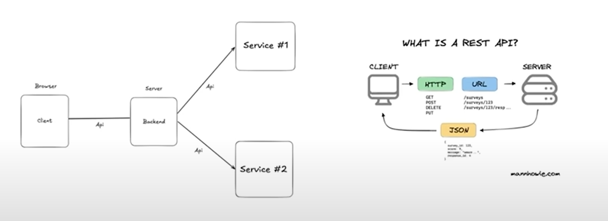
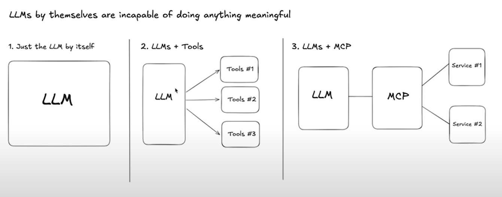
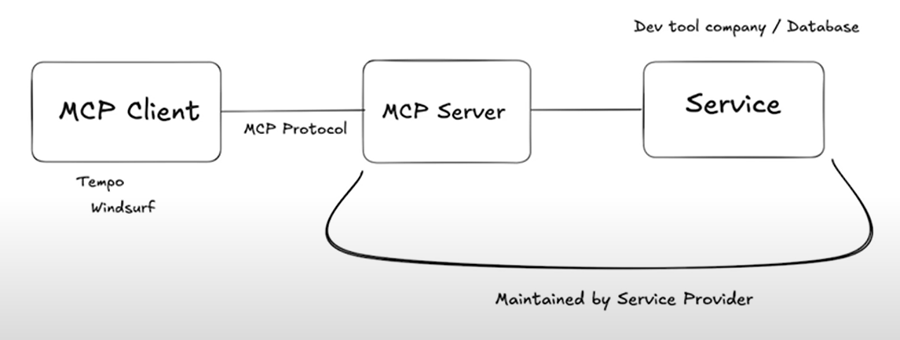
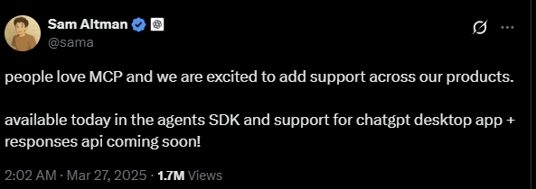

# MCP - Model Context Protocol

* *MCP, you can consider it to be a layer between your llm and the services and the tools and this layer translates all those different languages into a unified language that makes complete sense to the llm. - [Source: Model Context Protocol (MCP), clearly explained (why it matters)](https://youtu.be/7j_NE6Pjv-E?si=Axh186THqo6FYUZT)*

* *[Greg Isenberg](https://www.youtube.com/@GregIsenberg) - This is the startup ideas YouTube channel. Hosted by Greg Isenberg (CEO Late Checkout, ex-advisor of Reddit, TikTok etc).*

* *[Ras Mic](https://www.youtube.com/@rasmic) - Full Stack Engineer & YouTuber.*

## General API Concept

|General API Concept|left Side|
|-|-|
|Client|Represents a user or application (e.g., a web browser) that wants to access data or functionality.|
|Backend (Server)|Represents the server-side application that provides the data or functionality.|
|API (Application Programming Interface)|A set of rules and protocols that allow different software applications to communi1cate with each other. In this diagram, the API acts as the intermediary between the Client and the Backend, and between the Backend and various Services.|
|Service #1 and Service #2|Represent external services that the Backend might need to interact with to fulfill the Client's request. These could be databases, other applications, or specialized functionalities.|

|REST API Concept|right side|
|-|-|
|Client|Similar to the left side, it's the user or application making the request.|
|HTTP (Hypertext Transfer Protocol)|The protocol used for communication over the internet. REST APIs typically use HTTP methods like GET, POST, PUT, DELETE to perform operations.|
|URL (Uniform Resource Locator)|The address of the resource being requested or manipulated.|
|Server|The server that hosts the data and handles the requests.|
|JSON (JavaScript Object Notation)|A common data format used for exchanging data between the Client and Server. It's human-readable and easily parsed by machines.|

In essence, the left side shows a general architecture where a Client interacts with a Backend (Server) through an API, and the Backend might use other APIs to interact with different Services. The right side explains what a REST API is – a specific type of API that uses HTTP, URLs, and JSON for communication over the internet.

|API（應用程式介面）|左側|
|-|-|
|Client（客戶端）|代表想要存取資料或功能的用戶或應用程式（例如網頁瀏覽器）。|
|Backend (Server)（後端/伺服器）|代表提供資料或功能的伺服器端應用程式。|
|API（應用程式介面）|一組規則和協定，允許不同的軟體應用程式彼此通訊。 在此圖中，API 充當客戶端和後端之間，以及後端和各種服務之間的媒介。|
|Service #1 和 Service #2（服務 #1 和服務 #2）|代表後端可能需要互動才能滿足客戶端請求的外部服務。 這些可能是資料庫、其他應用程式或特殊功能。|

|REST API（具象狀態傳輸應用程式介面）|右側|
|-|-|
|Client（客戶端）|與左側類似，它是發出請求的用戶或應用程式。|
|HTTP（超文本傳輸協定）|用於在網際網路上進行通訊的協定。 REST API 通常使用 HTTP 方法，例如 GET、POST、PUT、DELETE 來執行操作。|
|URL（統一資源定位符）|被請求或操作的資源的地址。|
|Server（伺服器）|託管資料並處理請求的伺服器。|
|JSON（JavaScript 物件表示法）|用於在客戶端和伺服器之間交換資料的常用資料格式。 它是人類可讀的，並且可以被機器輕鬆解析。|

本質上，左側顯示了一個通用架構，其中客戶端透過 API 與後端（伺服器）互動，而後端可能使用其他 API 與不同的服務互動。 右側解釋了什麼是 REST API – 一種特定類型的 API，它使用 HTTP、URL 和 JSON 在網際網路上進行通訊。

---

## the evolution of Large Language Models (LLMs)

|Stages||
|-|-|
|Just the LLM by itself|This represents the basic LLM in isolation. The text above states that "LLMs by themselves are incapable of doing anything meaningful." This highlights the limitation of a raw LLM without any external tools or systems to interact with the real world.  It can process and generate text based on its training data, but it can't perform actions or access real-time information.|
|LLMs + Tools|This stage shows the LLM connected to external "Tools." These tools could be APIs, databases, or other software that allow the LLM to perform specific tasks. For example, a tool could be a search engine API to fetch real-time information, a calculator for mathematical operations, or a database to retrieve specific data.  This integration significantly expands the LLM's capabilities, allowing it to move beyond just text generation and into more practical applications.|
|LLMs + MCP|This stage introduces the concept of an "MCP" (likely standing for something like "Model Control Plane" or "Multi-Component Platform"). The MCP acts as an intermediary between the LLM and various "Services."  This suggests a more sophisticated architecture where the MCP manages the interaction between the LLM and multiple specialized services.  These services could be anything from specific data processing pipelines to user interface components. The MCP likely handles tasks like routing requests, managing data flow, and ensuring security and reliability.|

In essence, the image argues that LLMs become truly powerful when they are integrated with external tools and systems, moving from isolated text generators to components in a larger, more functional architecture.

|大型語言模型 (LLMs) 及其能力的演進||
|-|-|
|僅有 LLM 本身|這代表獨立運作的基本 LLM。 上方的文字說明「LLMs 本身無法做任何有意義的事情」。 這突顯了原始 LLM 的局限性，它沒有任何外部工具或系統與現實世界互動。 它可以根據其訓練數據處理和生成文本，但無法執行操作或訪問即時資訊。|
|LLMs + 工具|這個階段顯示 LLM 連接到外部「工具」。 這些工具可以是 API、資料庫或其他軟體，讓 LLM 執行特定任務。 例如，工具可以是搜尋引擎 API 來獲取即時資訊、用於數學運算的計算器或用於檢索特定資料的資料庫。 這種整合顯著擴展了 LLM 的能力，使其能夠超越僅僅生成文本，進入更實際的應用。|
|LLMs + MCP|這個階段引入了「MCP」（可能代表「模型控制平面」或「多組件平台」之類的東西）的概念。 MCP 充當 LLM 和各種「服務」之間的媒介。 這表明了一種更複雜的架構，其中 MCP 管理 LLM 和多個專用服務之間的互動。 這些服務可以是從特定的資料處理管道到使用者介面組件的任何東西。 MCP 可能處理諸如路由請求、管理資料流以及確保安全性和可靠性等任務。|

本質上，該圖片認為 LLM 與外部工具和系統整合後才會變得真正強大，從獨立的文本生成器轉變為更大、更具功能性架構中的組件。

---

## MCP Ecosystem Overview

|MCP Ecosystem Overview||
|-|-|
|MCP Client|Represents an application or component that wants to utilize a specific service. It initiates communication with the MCP Server. ["Tempo"](https://www.tempo.new/) and ["Windsurf"](https://codeium.com/) are given as examples of MCP Clients.|
|MCP Protocol|The communication protocol used between the MCP Client and the MCP Server. It defines the rules and format for exchanging messages.|
|MCP Server|Acts as an intermediary between the MCP Client and the Service. It likely manages requests, handles authentication, and ensures proper communication.|
|Service|The actual functionality or data that the MCP Client wants to access. It could be a database, an API, or any other external resource. The note "Dev tool company / Database" suggests the Service is provided by a development tool company or is a database.|
|"Maintained by Service Provider"|This note at the bottom indicates that the Service (and possibly the MCP Server) is managed and maintained by an external entity, the Service Provider. This implies that the MCP Client doesn't directly interact with the Service but goes through the MCP Server.|

In essence, the diagram shows a client-server architecture where the MCP Server acts as a gateway to a Service, using a defined protocol to facilitate communication. The service is maintained by a separate provider, indicating a separation of concerns and a potentially distributed system.

|MCP 生態系統概述||
|-|-|
|MCP 客戶端 (MCP Client)|代表想要使用特定服務的應用程式或元件。 它發起與 MCP 伺服器的通訊。 ["Tempo"](https://www.tempo.new/) 和 ["Windsurf"](https://codeium.com/) 被作為 MCP 客戶端的範例。|
|MCP 協定 (MCP Protocol)|MCP 客戶端和 MCP 伺服器之間使用的通訊協定。 它定義了交換訊息的規則和格式。|
|MCP 伺服器 (MCP Server)|充當 MCP 客戶端和服務之間的媒介。 它可能管理請求、處理身份驗證並確保正確的通訊。|
|服務 (Service)|MCP 客戶端想要存取的實際功能或資料。 它可以是資料庫、API 或任何其他外部資源。 「Dev tool company / Database」（開發工具公司/資料庫）的註解表明該服務由開發工具公司提供或是一個資料庫。|
|「由服務提供者維護 (Maintained by Service Provider)」|底部的註解表示服務（以及可能的 MCP 伺服器）由外部實體（服務提供者）管理和維護。 這意味著 MCP 客戶端不會直接與服務互動，而是透過 MCP 伺服器進行互動。|

本質上，該圖顯示了一個客戶端-伺服器架構，其中 MCP 伺服器充當服務的閘道，使用定義的協定來促進通訊。 該服務由單獨的提供者維護，表示關注點的分離和潛在的分散式系統。

---

## Conclusion on MCP's Potential

* The host inquired about potential startup opportunities arising from [MCP](https://www.anthropic.com/news/model-context-protocol), similar to those seen with protocols like HTTPS and SMTP, and whether it matters to individuals developing ideas.

* Professor Ross Mike suggested: For technical individuals, there are many opportunities. He proposed the idea of an [MCP App Store](https://www.mcpappstore.com/), where developers could easily find, install, and deploy MCP servers from various repositories. For non-technical individuals, he advised staying updated on platforms building MCP capabilities and observing the evolution of the standards. He noted that integrating tools is currently difficult, but finalized MCP standards will lead to much smoother integration. However, he cautioned that it's still very early stages for MCP, and significant business decisions might be premature, as a different standard could emerge, potentially from a major player like OpenAI. He recommended observing and learning for now, and being ready to act when the right standard is finalized

> OpenAI CEO Sam Altman said that OpenAI will add support for Anthropic’s Model Context Protocol, or MCP, across its products, including the desktop app for ChatGPT

* 主持人 Greg 最後問了一個問題，關於在 [MCP](https://www.anthropic.com/news/model-context-protocol) 這個協議普及之後，是否會像過去 HTTPS 或 SMTP 這樣的協議一樣，出現許多基於此協議的新創事業機會。他特別想知道這對於正在發展想法的聽眾是否有影響.

* 來賓 Professor Ross Mike 回答說，對於技術人員來說，他認為有很多機會。他舉了一個免費的想法，那就是可以創建一個 [MCP App Store](https://www.mcpappstore.com/)。他觀察到現在有很多 MCP 伺服器的程式碼儲存庫在各處，如果有人可以創建一個網站，讓使用者能夠瀏覽這些 MCP 伺服器，看到 GitHub 程式碼，然後可以點擊「安裝」或「部署」，這樣伺服器就會部署並給他們一個特定的 URL，他們可以將這個 URL 貼到 MCP 客戶端並開始使用. 他半開玩笑地說，如果有人因為這個想法賺了數百萬，只需要給他一千美元就好. 對於非技術人員來說，他建議關注那些正在建立 MCP 功能的平台，並留意最終的標準會是什麼。他提到雖然現在每週都有新的帶有工具的聊天機器人介面出現，但整合這些工具並不容易。他認為，一旦 MCP 的標準確定下來，並且服務提供商開始建構他們的 mCP 或類似的東西，非技術人員就能夠更無縫、更輕鬆地進行整合. 然而，他也指出，目前來看，無論是對於非技術人員還是技術人員，現在就採取重大的商業決策可能還為時過早，因為 MCP 仍處於非常早期的階段。他提到，如果像 OpenAI 這樣的公司明天提出一個新的標準，那麼現在的一切都可能會改變。因此，他建議大家現在要做的就是觀察、學習，等待時機成熟再採取行動。他認為，理解 MCP 的運作方式將有助於理解未來可能出現的新事物，並在最終標準確定時能夠迅速行動。