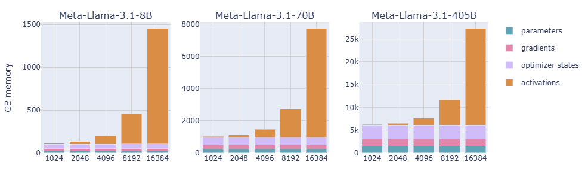

# Multi GPUs Training LLMs From Scratch

> [Source: Using multiple GPUs to train large language models—introduced from scratch](https://youtu.be/mpuRca2UZtI?si=HDRdOCoXFYRoVPVz)

## forward and backward pass

> **Forward Pass**: - We start with an input sentence, "The dog chased its..."
This input is fed into the LLM, which contains a set of weights (parameters). These weights are what the model learns and adjusts during training.
The LLM processes the input and produces an output distribution. This distribution represents the model's prediction for the next word in the sentence. In this example, the model predicts "tail" with a probability of 0.65, "shadow" with 0.12, "ball" with 0.08, and "owner" with 0.02, among other possibilities.
The Loss Function compares this predicted distribution with the actual label (the correct next word, which is "tail" in this case). The loss function calculates how wrong the model's prediction was.

> **Backward Pass (Backpropagation)**: The error calculated by the loss function is used to compute the gradients of the loss with respect to the LLM's weights.
These gradients indicate how much each weight contributed to the error.
The gradients are then used by an optimizer algorithm to update the LLM's weights. The optimizer aims to minimize the loss by adjusting the weights in the direction that reduces the error.
In essence, the forward pass is where the model makes a prediction, and the backward pass is where it learns from its mistakes by adjusting its weights based on the error.


## 這個圖表展示了使用前向和反向傳遞方法訓練大型語言模型（LLM）的核心過程。

> **前向傳遞**： 我們從一個輸入句子開始：“The dog chased its...”
這個輸入被送入LLM，它包含一組權重（參數）。這些權重是模型在訓練過程中學習和調整的內容。
LLM處理輸入並產生一個輸出分佈。這個分佈代表模型對句子中下一個詞的預測。在這個例子中，模型預測“tail”的概率為0.65，“shadow”為0.12，“ball”為0.08，“owner”為0.02，以及其他可能性。
損失函數將這個預測分佈與實際的標籤（正確的下一個詞，在本例中為“tail”）進行比較。損失函數計算模型預測的錯誤程度。

> **反向傳遞（反向傳播）**： 損失函數計算出的誤差被用來計算損失相對於LLM權重的梯度。
這些梯度表示每個權重對誤差的貢獻程度。
然後，優化器算法使用這些梯度來更新LLM的權重。優化器的目標是通過朝著減少誤差的方向調整權重來最小化損失。
簡而言之，前向傳遞是模型進行預測的地方，而反向傳遞是模型通過基於誤差調整其權重來從錯誤中學習的地方。

---

## memory requirements 

This diagram illustrates the memory requirements for training an 8B parameter LLM, highlighting the impact of using 16-bit floating-point precision (fp16) and the Adam optimizer.

|memory requirements||
|-|-|
|Memory Calculation (Top)|The diagram starts by calculating the memory needed to store the LLM's weights in fp16 format. 8B parameters are equivalent to 8 * 10^9 parameters. Each fp16 parameter requires 16 bits of storage. Therefore, the total memory for the weights is: 8 * 10^9 * 16 bits = 128 * 10^9 bits = 16GB.|
|Training Process (Middle)|The core of the training involves the LLM weights, gradients, and the Adam optimizer.|
||**LLM Weights**: The diagram shows the weights initially requiring 32GB (likely in 32-bit floating-point precision, fp32).|
||**Adam Optimizer**: The Adam optimizer maintains two additional sets of values for each parameter:<br>**Momentum**: Tracks the moving average of the gradients.<br>**Variance**: Tracks the moving average of the squared gradients.<br>Both momentum and variance require the same memory as the weights, resulting in 32GB each.|
|Optimization (Left)|The diagram mentions "Utilize optimized fp16 computation on GPU." This indicates a shift to using fp16 for calculations on the GPU to reduce memory usage and potentially improve speed.|
||LLM Weights (fp16): The weights are converted to fp16, reducing their memory footprint to 16GB.|
||LLM Gradients (fp16): The gradients are also stored in fp16, requiring 16GB.|
|Total Memory Calculation (Bottom)|The total memory required for training is the sum of the memory for the weights, gradients, momentum, and variance:<br>16GB (weights) + 16GB (gradients) + 32GB (momentum) + 64GB (variance) = 128GB.|
|Note on Adam Memory|The diagram incorrectly lists "64GB" for variance. It should be 32GB. The correct total memory is: 16GB + 16GB + 32GB + 32GB = 96GB.|
|Accelerator Memory (Right)|The diagram provides memory information for different GPUs:<br>T4: 16GB<br>4090: 24GB<br>A100: 40GB<br>H100: 80GB|

Key Takeaway: Training an 8B parameter model requires significant memory. Using fp16 reduces memory usage, but the Adam optimizer's momentum and variance still contribute substantially to the overall memory footprint.


這個圖表展示了訓練一個80億參數（8B）大型語言模型（LLM）所需的記憶體需求，並強調了使用16位浮點精度（fp16）和Adam優化器的影響。

|記憶體需求||
|-|-|
|記憶體計算（頂部|圖表首先計算以fp16格式儲存LLM權重所需的記憶體。 8B參數相當於8 * 10^9個參數。 每個fp16參數需要16位元的儲存空間。 因此，權重的總記憶體為：8 * 10^9 * 16 位元 = 128 * 10^9 位元 = 16GB。|
|訓練過程（中部）|訓練的核心涉及LLM權重、梯度和Adam優化器。|
||LLM權重： 圖表顯示權重最初需要32GB（可能是32位浮點精度，fp32）。|
||Adam優化器： Adam優化器為每個參數維護兩組額外的值：<br>**動量（Momentum）**： 追蹤梯度的移動平均值。<br>**變異數（Variance）**： 追蹤梯度平方的移動平均值。<br>動量和變異數都需要與權重相同的記憶體，各產生32GB。|
|優化（左側）|圖表提到“在GPU上利用優化的fp16計算”。這表明轉向在GPU上使用fp16進行計算，以減少記憶體使用量並可能提高速度。|
||LLM權重（fp16）： 權重轉換為fp16，將記憶體佔用量減少到16GB。|
||LLM梯度（fp16）： 梯度也以fp16儲存，需要16GB。|
|總記憶體計算（底部）|訓練所需的總記憶體是權重、梯度、動量和變異數的記憶體總和：<br>16GB（權重）+ 16GB（梯度）+ 32GB（動量）+ 64GB（變異數）= 128GB。|
|Adam記憶體的注意事項|圖表錯誤地列出“64GB”作為變異數的記憶體。它應該是32GB。正確的總記憶體是：16GB + 16GB + 32GB + 32GB = 96GB。|
|加速器記憶體（右側）|圖表提供了不同GPU的記憶體資訊：<br>T4：16GB<br>4090：24GB<br>A100：40GB<br>H100：80GB|

關鍵要點： 訓練一個8B參數模型需要大量記憶體。使用fp16可以減少記憶體使用量，但Adam優化器的動量和變異數仍然對整體記憶體佔用量有很大貢獻。

---

## activations

This diagram illustrates the memory considerations for activations in an LLM with 32 layers, emphasizing the concept of activation recomputation to reduce memory usage.

### 1. Activation Memory Calculation (Top Right)

The diagram focuses on the memory required for activations in a single layer of the LLM.
For a batch size of 1 (a single sequence being processed at a time), the memory is estimated as:
40GB for the attention mechanism.
2.2GB for the feed-forward network.
Plus some additional memory for layer normalization.
This single layer requires approximately 42.2GB (40GB + 2.2GB).
Since the model has 32 layers, the total activation memory would be: 42.2GB * 32 = 1350.4GB, or approximately 1.35TB.

### 2. Input Data (Left)

The input data consists of:
16k tokens (e.g., reasoning data).
256 tokens.
The diagram doesn't specify the memory required for the input data itself, but it's implied that it's significantly smaller than the activation memory.

### 3. LLM Weights (Center)

The diagram also includes the LLM weights, but the focus is primarily on activations.

### 4. Activation Recomputation (Bottom):

The diagram introduces the concept of activation recomputation, also known as gradient checkpointing.
How it works: During the forward pass, instead of saving all activations for every layer, only "important activations" are saved.
When needed during the backward pass (for gradient computation), the other activations are recomputed.
Trade-off: This method reduces memory usage but increases computation time (computation overhead) as activations need to be recalculated.

In essence, activation recomputation sacrifices computation speed to reduce memory requirements, making it possible to train larger models on hardware with limited memory.


這個圖表說明了大型語言模型（LLM）中激活值的記憶體考量，並強調了激活值重新計算（梯度檢查點）如何幫助管理它們。

### 1. 激活值記憶體計算（右上角）

圖表重點關注LLM單層中激活值所需的記憶體。
對於批次大小為1（一次處理一個序列），記憶體估計為：
注意力機制為40GB。
前饋網路為2.2GB。
加上層歸一化的一些額外記憶體。
這一層大約需要42.2GB（40GB + 2.2GB）。
由於模型有32層，總激活值記憶體將為：42.2GB * 32 = 1350.4GB，或大約1.35TB。

### 2. 輸入資料（左側）

輸入資料包括：
16k個標記（例如，推理資料）。
256個標記。
圖表沒有指定輸入資料本身所需的記憶體，但暗示它遠小於激活值記憶體。

### 3. LLM權重（中心）

圖表還包括LLM權重，但重點主要是激活值。

### 4. 激活值重新計算（底部）

圖表介紹了激活值重新計算的概念，也稱為梯度檢查點。
工作原理： 在前向傳遞期間，不是保存每一層的所有激活值，而是僅保存“重要激活值”。
在反向傳遞期間（用於梯度計算）需要時，重新計算其他激活值。
權衡： 這種方法減少了記憶體使用量，但增加了計算時間（計算開銷），因為需要重新計算激活值。

簡而言之，激活值重新計算犧牲了計算速度來減少記憶體需求，從而在記憶體有限的硬體上訓練更大的模型成為可能。

---

## batch size

### Batch Size Importance

"Batch size should be large enough to provide clear gradient." This means that a sufficiently large batch size is needed to calculate a gradient that accurately represents the overall direction to update the model's weights.
"Generally 4-60M tokens per batch." This gives a general guideline for the number of tokens to include in a batch.
"DeepSeek V3 uses batch size 1920 for 32K context, which is 61M tokens." This provides a specific example where DeepSeek V3 uses a batch size of 1920 with a 32K token context, resulting in approximately 61 million tokens per batch.

### Gradient Accumulation

"Global batch size = mini batch size * gradient accumulation." This formula explains how gradient accumulation works.
Global batch size: The effective batch size used to calculate the gradient.
Mini batch size: The actual number of samples processed at a time (constrained by memory).
Gradient accumulation: The number of mini-batches processed before updating the model's weights.
"e.g. 1920 = 16 * 120." This example shows how a global batch size of 1920 can be achieved using a mini-batch size of 16 and gradient accumulation of 120.
In essence, gradient accumulation allows you to simulate a larger batch size by accumulating gradients from multiple smaller mini-batches, effectively overcoming memory limitations.


### 批次大小的重要性

“批次大小應該足夠大，以提供清晰的梯度。” 這意味著需要足夠大的批次大小來計算準確表示更新模型權重的整體方向的梯度。
“通常每個批次4-60M個標記。” 這為每個批次中包含的標記數量提供了一般準則。
“DeepSeek V3使用批次大小1920，上下文為32K，即61M個標記。” 這提供了一個具體範例，其中DeepSeek V3使用批次大小1920，上下文為32K個標記，每個批次產生大約6100萬個標記。

### 梯度累積

“全局批次大小 = 小批次大小 * 梯度累積。” 這個公式解釋了梯度累積的工作原理。
全局批次大小： 用於計算梯度的有效批次大小。
小批次大小： 一次處理的實際樣本數量（受記憶體限制）。
梯度累積： 在更新模型權重之前處理的小批次數量。
“例如，1920 = 16 * 120。” 這個範例展示了如何使用小批次大小16和梯度累積120次前向傳遞和反向傳遞, 來實現全局批次大小1920。
簡而言之，梯度累積允許您通過累積多個較小的小批次的梯度來模擬更大的批次大小，從而有效地克服記憶體限制。

---

## activantion memory

This chart illustrates the memory usage (in Gigabytes, GB) for three different sizes of the Meta-Llama-3.1 language model: 8 billion parameters (8B), 70 billion parameters (70B), and 405 billion parameters (405B). 

|The memory usage is categorized into four main components||
|-|-|
|Parameters|The memory required to store the model's weights or learned values.|
|Gradients|The memory needed to store the gradients, which are used to update the model weights during training.|
|Optimizer States|The memory occupied by the optimizer, which maintains information like momentum and variance for efficient weight updates.|
|Activations|The memory required to store the intermediate outputs of the model's layers during the forward and backward passes.|

|Key Observations||
|-|-|
|Memory Scaling with Model Size|As the model size increases (from 8B to 70B to 405B), the overall memory consumption rises dramatically. This highlights the memory challenges associated with training larger models.|
|Dominance of Activations|For larger models, especially 70B and 405B, the memory used for activations becomes the most significant factor. This indicates that storing intermediate computations during training consumes a substantial amount of memory.|
|Impact of Sequence Length|The x-axis represents sequence lengths (1024, 2048, 4096, 8192, 16384). As the sequence length increases, the memory required for activations also increases, showing a direct correlation between sequence length and memory usage.|
|Logarithmic Scale Variation|Note that the y-axis scales differ across the three charts. This is done to accommodate the vast differences in memory usage between the models, allowing for clearer visualization of the trends within each model size.|

|Implications||
|-|-|
|Hardware Limitations|Training larger models requires significant memory resources, potentially exceeding the capacity of standard GPUs.|
|Memory Optimization|Techniques like gradient checkpointing or activation recomputation become critical for training large models efficiently.|
|Sequence Length Trade-offs|The length of sequences that can be processed is limited by available memory, requiring careful consideration of sequence length during training and inference.|


[Source - ](https://huggingface.co/spaces/nanotron/ultrascale-playbook?section=activation_recomputation)Huggingface/The Ultra-Scale Playbook: Training LLMs on GPU Clusters

這個圖表說明了Meta-Llama-3.1語言模型三種不同大小的記憶體使用量（以GB為單位）：80億參數（8B）、700億參數（70B）和4050億參數（405B）。

|記憶體使用量分為四個主要組成部分||
|-|-|
|參數 (Parameters)|儲存模型權重或學習值所需的記憶體。|
|梯度 (Gradients)|儲存梯度所需的記憶體，梯度用於在訓練期間更新模型權重。|
|優化器狀態 (Optimizer States)|優化器佔用的記憶體，它維護動量和變異數等資訊，以實現高效的權重更新。|
|激活值 (Activations)|儲存在前向和反向傳遞期間模型層的中間輸出所需的記憶體。|

|主要觀察結果||
|-|-|
|記憶體隨模型大小縮放|隨著模型大小的增加（從8B到70B到405B），整體記憶體消耗顯著增加。這突顯了訓練較大模型相關的記憶體挑戰。|
|激活值佔主導地位|對於較大的模型，尤其是70B和405B，用於激活值的記憶體成為最重要的因素。這表明在訓練期間儲存中間計算消耗了大量記憶體。|
|序列長度的影響|x軸表示序列長度（1024、2048、4096、8192、16384）。隨著序列長度的增加，激活值所需的記憶體也增加，顯示序列長度和記憶體使用量之間存在直接相關性。|
|對數刻度變化|請注意，三個圖表的y軸刻度不同。這樣做是為了適應模型之間記憶體使用量的巨大差異，從而在每個模型大小中更清楚地可視化趨勢。|

|影響||
|-|-|
|硬體限制|訓練較大的模型需要大量的記憶體資源，可能會超出標準GPU的容量。|
|記憶體優化|梯度檢查點或激活值重新計算等技術對於有效訓練大型模型至關重要。|
|序列長度權衡|可以處理的序列長度受到可用記憶體的限制，需要在訓練和推理期間仔細考慮序列長度。|

----

## multiple gpus

This diagram illustrates the memory considerations when training LLMs across multiple GPUs, specifically focusing on the storage of parameters, gradients, and optimizer states.

### 1. The Problem: Training Large Models

"We have to compute billions of optimization steps, with large batch size." LLM training requires massive computations and large datasets, making it computationally intensive.
"The model may be too large to fit in a single GPU." The sheer size of LLMs often exceeds the memory capacity of a single GPU.
"The input can be long. Self-attention takes O(N^2) memory." Long sequences and the self-attention mechanism in Transformers contribute to significant memory usage.

### 2. The Solution: Leveraging Multiple GPUs

|"Assume we have 4 GPUs."|The diagram illustrates a scenario with four GPUs to distribute the training workload.|
|-|-|
|GPU 1: This GPU is shown to hold|LLM weights (16bit): The parameters of the model, stored in half-precision (16-bit) to reduce memory.|
||Gradients (16bit): The gradients calculated during backpropagation, also in 16-bit.|
||LLM weights (32bit): A copy of the model weights in full-precision (32-bit), likely for optimizer updates.|
||Optimizer states (32bit): The optimizer's internal values (e.g., momentum, variance) in 32-bit.|
|GPU 2, 3, 4: These GPUs are shown to each hold|LLM weights: A portion of the model weights.|
||Gradients: The gradients for their respective portion of the model.|
||Optimizer states: The optimizer states for their portion of the model.|

### 3. The Challenge: Memory Limitations

"Most of GPUs cannot fit all the components." This highlights the fundamental challenge: even with multiple GPUs, the combined memory requirements of parameters, gradients, and optimizer states can still exceed the available GPU memory.

In essence, this diagram illustrates the need for efficient memory management and distributed training strategies when dealing with large language models, as even distributing the workload across multiple GPUs might not be enough to fit the entire model and training data.


這個圖表說明了在多個GPU上訓練大型語言模型（LLM）時的記憶體考量，特別關注參數、梯度和優化器狀態的儲存。

### 1. 問題：訓練大型模型

“我們必須計算數十億個優化步驟，使用大批次大小。” LLM訓練需要大量的計算和龐大的資料集，使其計算密集。
“模型可能太大，無法容納在單個GPU中。” LLM的龐大規模通常超過單個GPU的記憶體容量。
“輸入可能很長。自注意力機制佔用O(N^2)記憶體。” 長序列和Transformer中的自注意力機制導致顯著的記憶體使用量。

### 2. 解決方案：利用多個GPU

|“假設我們有4個GPU。” |該圖說明了一個使用四個GPU分配訓練工作負載的場景。|
|-|-|
|GPU 1： 這個GPU顯示包含|LLM權重（16位元）： 模型的參數，以半精度（16位元）儲存以減少記憶體。|
||梯度（16位元）： 在反向傳播期間計算的梯度，也以16位元儲存。|
||LLM權重（32位元）： 模型權重的全精度（32位元）副本，可能是為了優化器更新。|
||優化器狀態（32位元）： 優化器的內部值（例如，動量、變異數），以32位元儲存。|
|GPU 2、3、4： 這些GPU顯示每個包含|LLM權重： 模型權重的一部分。|
||梯度： 其模型相應部分的梯度。|
||優化器狀態： 其模型部分的優化器狀態。|

### 3. 挑戰：記憶體限制

“大多數GPU無法容納所有元件。” 這突顯了根本的挑戰：即使使用多個GPU，參數、梯度和優化器狀態的組合記憶體需求仍然可能超過可用的GPU記憶體。

簡而言之，該圖說明了在處理大型語言模型時需要有效的記憶體管理和分散式訓練策略，因為即使將工作負載分配到多個GPU上，也可能不足以容納整個模型和訓練資料。

---

## zero

This diagram illustrates how DeepSpeed's ZeRO technique optimizes memory usage during the training of large language models (LLMs) across multiple GPUs. ZeRO aims to reduce redundancy in storing parameters, gradients, and optimizer states, enabling the training of larger models with limited GPU memory.

|Zero-1||
|-|-|
|Focus|Partitioning the optimizer states across GPUs.|
|Process|Each GPU stores a portion of the optimizer states (e.g., momentum, variance for Adam). LLM weights and gradients remain replicated across all GPUs. Communication (blue arrows) occurs between GPUs to update optimizer states.|
|Benefit|Reduces memory footprint compared to standard data parallelism, as optimizer states are not fully replicated on each GPU.|

|Zero-2||
|-|-|
|Focus|Partitioning both optimizer states and gradients across GPUs.|
|Process|Optimizer states are partitioned (same as Zero-1). Gradients are also partitioned across GPUs.Communication (orange arrows) occurs between GPUs to gather necessary gradients for weight updates.|
|Benefit|Further reduces memory footprint compared to Zero-1 by not replicating gradients across all GPUs.|

|Zero-3||
|-|-|
|Focus|Partitioning optimizer states, gradients, and model parameters across GPUs.|
|Process|Optimizer states and gradients are partitioned (same as Zero-2). Model parameters (LLM weights) are also partitioned across GPUs. Communication (red arrows) occurs between GPUs to gather necessary parameters and gradients for forward and backward passes.|
|Benefit|Significantly reduces memory footprint compared to Zero-2 by not replicating model parameters, allowing for training of much larger models.|
|NVLink|The diagram mentions "NVLink: 900GB/s," indicating the high-speed interconnect used for efficient communication between GPUs.|

|Key Concepts||
|-|-|
|Data Parallelism|Standard data parallelism replicates the entire model on each GPU, leading to high memory redundancy.|
|ZeRO|ZeRO eliminates this redundancy by partitioning optimizer states, gradients, and parameters across GPUs.|
|Communication Overhead|ZeRO introduces communication overhead as GPUs need to exchange data, but this is often outweighed by the memory savings.|

In essence, ZeRO allows for training larger models by reducing memory redundancy and distributing the memory load across multiple GPUs, with Zero-3 being the most memory-efficient but also the most communication-intensive.


這個圖表說明了DeepSpeed的ZeRO（零冗餘優化器）技術如何在多個GPU上訓練大型語言模型（LLM）時優化記憶體使用。ZeRO旨在減少儲存參數、梯度和優化器狀態的冗餘，從而在有限的GPU記憶體下訓練更大的模型。

|Zero-1||
|-|-|
|重點|將優化器狀態在GPU之間進行分割。|
|過程|每個GPU儲存部分優化器狀態（例如，Adam的動量、變異數）。LLM權重和梯度在所有GPU上保持複製。GPU之間進行通訊（藍色箭頭）以更新優化器狀態。|
|優點|與標準資料並行相比，減少了記憶體佔用量，因為優化器狀態不會在每個GPU上完全複製。|

|Zero-2||
|-|-|
|重點|將優化器狀態和梯度在GPU之間進行分割。|
|過程|優化器狀態被分割（與Zero-1相同）。梯度也在GPU之間進行分割。GPU之間進行通訊（橙色箭頭）以收集權重更新所需的梯度。|
|優點|與Zero-1相比，透過不在所有GPU上複製梯度，進一步減少了記憶體佔用量。|

|Zero-3||
|-|-|
|重點|將優化器狀態、梯度和模型參數在GPU之間進行分割。|
|過程|優化器狀態和梯度被分割（與Zero-2相同）。模型參數（LLM權重）也在GPU之間進行分割。GPU之間進行通訊（紅色箭頭）以收集前向和反向傳遞所需的參數和梯度。|
|優點|與Zero-2相比，透過不複製模型參數，顯著減少了記憶體佔用量，從而可以訓練更大的模型。|
|NVLink|該圖提到“NVLink：900GB/s”，表示用於GPU之間高效通訊的高速互連。|

|關鍵概念||
|-|-|
|資料並行|標準資料並行在每個GPU上複製整個模型，導致高記憶體冗餘。|
|ZeRO|ZeRO透過在GPU之間分割優化器狀態、梯度和參數來消除這種冗餘。|
|通訊開銷|ZeRO引入了通訊開銷，因為GPU需要交換資料，但這通常被記憶體節省所抵消。|

簡而言之，ZeRO透過減少記憶體冗餘並在多個GPU之間分配記憶體負載，從而可以訓練更大的模型，其中Zero-3是記憶體效率最高但通訊密集度也最高的。

---

## memory reduction

This diagram illustrates how different ZeRO optimization stages reduce memory usage when training an 8B model across 8 GPUs (DP=8, meaning Data Parallelism with 8 GPUs). It compares memory usage across standard data parallelism (DP=8) and ZeRO stages 1, 2, and 3.

|Memory Usage for 8B Model||
|-|-|
|DP=8 (Standard Data Parallelism)|Shows the highest memory usage, particularly for activations, which increase significantly with sequence length.The red dotted line represents a hypothetical memory limit, which is exceeded at longer sequence lengths.|
|DP=8 Zero-1|Reduces memory usage compared to standard data parallelism, primarily by partitioning optimizer states. Activations still contribute significantly to memory usage at longer sequence lengths.|
|DP=8 Zero-2|Further reduces memory usage compared to Zero-1 by partitioning both optimizer states and gradients. Memory usage for activations is still present but lower.|
|DP=8 Zero-3|Shows the lowest memory usage overall, as it partitions optimizer states, gradients, and model parameters. Memory usage for activations is minimized, allowing for training at longer sequence lengths within the memory limit.|

### Training Speed

"Varies based on network bandwidth, model size, and specific hardware configuration." This highlights that the training speed impact of ZeRO depends on various factors.
"Generally, it will not slow down by an order of magnitude." This indicates that while ZeRO introduces communication overhead, it doesn't drastically slow down training, especially with high-bandwidth interconnects like NVLink.

|Key Concepts||
|-|-|
|Data Parallelism (DP)|Replicates the entire model on each GPU, leading to high memory redundancy.|
|ZeRO (Zero Redundancy Optimizer)|Partitions optimizer states, gradients, and parameters across GPUs to reduce memory footprint.|
|Activations|Intermediate outputs of model layers, which consume significant memory, especially at longer sequence lengths.|

In essence, this diagram shows how ZeRO effectively reduces memory usage, enabling the training of larger models or processing longer sequences on limited GPU memory, with a manageable impact on training speed.


這個圖表說明了使用DeepSpeed的ZeRO優化技術訓練80億參數（8B）模型時，不同的ZeRO優化階段如何減少記憶體使用量。它比較了標準資料並行（DP=8）和ZeRO階段1、2和3的記憶體使用量。

|8B模型記憶體使用量||
|-|-|
|DP=8（標準資料並行）|顯示最高的記憶體使用量，特別是對於激活值，激活值隨著序列長度顯著增加。 紅色虛線代表假設的記憶體限制，在較長的序列長度下超過了該限制。|
|DP=8 Zero-1|與標準資料並行相比，減少了記憶體使用量，主要是透過分割優化器狀態。 在較長的序列長度下，激活值仍然對記憶體使用量有顯著影響。|
|DP=8 Zero-2|與Zero-1相比，透過分割優化器狀態和梯度，進一步減少了記憶體使用量。 激活值的記憶體使用量仍然存在，但較低。|
|DP=8 Zero-3|顯示整體最低的記憶體使用量，因為它分割了優化器狀態、梯度和模型參數。 激活值的記憶體使用量被最小化，允許在記憶體限制內訓練更長的序列長度。|

### 訓練速度

“因網路頻寬、模型大小和特定硬體配置而異。” 這強調了ZeRO的訓練速度影響取決於多種因素。
“一般來說，它不會減慢一個數量級。” 這表明雖然ZeRO引入了通訊開銷，但它不會顯著減慢訓練速度，特別是對於像NVLink這樣的高頻寬互連。

|關鍵概念||
|-|-|
|資料並行（DP）|在每個GPU上複製整個模型，導致高記憶體冗餘。|
|ZeRO（零冗餘優化器）|在GPU之間分割優化器狀態、梯度和參數，以減少記憶體佔用量。|
|激活值|模型層的中間輸出，消耗大量記憶體，特別是在較長的序列長度下。|

簡而言之，這個圖表顯示了ZeRO如何有效地減少記憶體使用量，從而在有限的GPU記憶體上訓練更大的模型或處理更長的序列，並且對
訓練速度的影響在可控範圍內。

---

### ZeRO-Offload Concept

This diagram illustrates the ZeRO-Offload technique, a further optimization strategy for training large language models (LLMs) when GPU memory is extremely limited. It involves moving data to the CPU's RAM, which is typically larger than GPU memory but slower.

|ZeRO-Offload Concepts||
|-|-|
|GPU ram vs. CPU ram|The diagram highlights the significant difference in memory capacity between GPU RAM and CPU RAM. CPU RAM is shown as being 10x larger than GPU RAM.|
|16bit world & 32bit world|This refers to the precision of data storage. 16-bit (half-precision) is used to reduce memory, while 32-bit (full-precision) is used for accuracy-sensitive operations.|
|"Warn: using offload can be very slow."|This is a critical note. Moving data between GPU and CPU is slow due to the PCIe bus bandwidth limitations. Offloading should be used as a last resort when GPUs cannot fit the model.|

|Optimizer Offload||
|-|-|
|Process|The optimizer states (which are typically large) are moved to the CPU RAM. The LLM weights (16-bit) and gradients remain on the GPU for faster computation.|
|Communication|Data is transferred between the GPU and CPU as needed (indicated by the arrows).|
|Benefit|Reduces GPU memory usage by offloading the optimizer, allowing for training of models that wouldn't fit on the GPU otherwise.|

|Optimizer + Model Parameter Offload (Bottom)||
|-|-|
|Process|Both the optimizer states and the model parameters (LLM 16bit) are moved to the CPU RAM. Only the gradients are kept on the GPU.|
|Communication|More data is transferred between the GPU and CPU compared to optimizer offload alone.|
|Benefit|Further reduces GPU memory usage, but at a higher communication cost. This is used when even optimizer offload is insufficient.|

In essence, ZeRO-Offload is a memory-saving technique that trades off computation speed for memory capacity. It should be used judiciously, as the CPU-GPU data transfer can significantly slow down training.


這個圖表說明了ZeRO-Offload技術，這是一種在GPU記憶體極其有限時用於進一步減少GPU記憶體使用量的最佳化策略。它涉及將模型和優化器的部分資料移動到CPU的RAM，CPU的RAM通常比GPU記憶體大，但速度較慢。

|ZeRO-Offload概念||
|-|-|
|GPU ram vs. CPU ram|該圖強調了GPU RAM和CPU RAM之間記憶體容量的顯著差異。CPU RAM顯示為比GPU RAM大10倍。|
|16位元世界和32位元世界|這指的是資料儲存的精度。16位元（半精度）用於減少記憶體，而32位元（全精度）用於精度敏感的操作。|
|“警告：使用卸載可能非常慢。”|這是一個重要的注意事項。由於PCIe匯流排頻寬的限制，在GPU和CPU之間移動資料很慢。當GPU無法容納模型時，應將卸載作為最後的手段。|

|優化器卸載||
|-|-|
|過程|優化器狀態（通常很大）被移動到CPU RAM。LLM權重（16位元）和梯度保留在GPU上以進行更快的計算。|
|通訊|資料根據需要（由箭頭指示）在GPU和CPU之間傳輸。|
|優點|透過卸載優化器來減少GPU記憶體使用量，從而可以訓練否則無法容納在GPU上的模型。|

|優化器 + 模型參數卸載||
|-|-|
|過程|優化器狀態和模型參數（LLM 16位元）都被移動到CPU RAM。只有梯度保留在GPU上。|
|通訊|與僅優化器卸載相比，GPU和CPU之間傳輸的資料更多。|
|優點|進一步減少GPU記憶體使用量，但通訊成本更高。當僅優化器卸載不足時使用。|

簡而言之，ZeRO-Offload是一種以計算速度換取記憶體容量的記憶體節省技術。應謹慎使用，因為CPU-GPU資料傳輸會顯著減慢訓練速度。

----

## Experiment Setup

This diagram shows a simple experiment conducted on the TWCC using DeepSpeed's ZeRO optimization to compare memory usage and training speed with and without the ZeRO-Offload feature.

|Experiment Setup||
|-|-|
|Code Repository|The experiment uses the code available at the provided GitHub link: https://github.com/anthony-wss/deepspeed-boilerplate/tree/main|
|Focus|The experiment compares memory usage and training speed under different configurations of ZeRO, specifically with and without offloading to the CPU.|

|4 GPUs with Offload||
|Memory Usage|Per CPU: The CPU memory usage varies significantly, ranging from 11.74GB to 201.93GB.|
||Per GPU: The GPU memory usage is relatively low, ranging from 1.96GB to 35.61GB.|
|Options|offload_param=cpu: Offloads model parameters to the CPU.|
||offload_optimizer=cpu: Offloads optimizer states to the CPU.|
||zero_init=1: Initializes the model using ZeRO.|
||zero_init=0: Initializes the model without ZeRO.|
|Speed|The training speed is reported as 15GB per GPU and 74 seconds per step, with a batch size of 1 and maximum sequence length of 512.|

|8 GPUs: No Offload||
|-|-|
|Memory Usage|Per CPU: The CPU memory usage is similar to the 4 GPU case, ranging from 3.83GB to 358.98GB.|
||Per GPU: The GPU memory usage is higher than the 4 GPU case, ranging from 3.83GB to 18.78GB.|
|Options|The same options as the 4 GPU case are used.|
|Speed|The training speed is significantly faster, at 7.3 seconds per step, with the same batch size and sequence length.|
|vRAM|The experiment notes that 24-32GB of vRAM (GPU memory) is used per GPU, which can vary but will not result in Out-Of-Memory (OOM) errors.|

|Key Observations||
|-|-|
|Offload Impact|Using ZeRO-Offload reduces GPU memory usage but significantly slows down training (74s vs. 7.3s per step).|
|Speed Trade-off|There is a clear trade-off between memory usage and training speed when using offloading.|
|ZeRO Initialization|The zero_init parameter affects memory usage but doesn't drastically change the overall trend of offloading's impact.|
|vRAM Usage|Using 8 GPUs without offloading allows for faster training and efficient memory usage without OOM errors.|

In essence, this experiment demonstrates that while ZeRO-Offload can reduce GPU memory consumption, it comes at a significant cost in training speed. Using more GPUs without offloading provides faster training and manageable GPU memory usage for the given configuration.


### 實驗設定

這個圖表展示了在TWCC（台灣計算雲）上進行的一個簡單實驗的結果，該實驗重點在使用和不使用ZeRO-Offload時的記憶體使用量和訓練速度。

|實驗設定||
|-|-|
|程式碼儲存庫|實驗使用提供的GitHub連結上的可用程式碼：https://github.com/anthony-wss/deepspeed-boilerplate/tree/main|
|重點|實驗比較了ZeRO的不同配置下的記憶體使用量和訓練速度，特別是有沒有將資料卸載到CPU。|

|4個GPU，使用卸載||
|-|-|
|記憶體使用量|每個CPU： CPU記憶體使用量變化很大，範圍從11.74GB到201.93GB。|
||每個GPU： GPU記憶體使用量相對較低，範圍從1.96GB到35.61GB。|
|選項|offload_param=cpu：將模型參數卸載到CPU。|
||offload_optimizer=cpu：將優化器狀態卸載到CPU。|
||zero_init=1：使用ZeRO初始化模型。|
||zero_init=0：不使用ZeRO初始化模型。|
|速度|訓練速度報告為每個GPU 15GB，每步74秒，批次大小為1，最大序列長度為512。|

|8個GPU，不使用卸載||
|-|-|
|記憶體使用量|每個CPU： CPU記憶體使用量與4個GPU的情況類似，範圍從3.83GB到358.98GB。|
||每個GPU： GPU記憶體使用量高於4個GPU的情況，範圍從3.83GB到18.78GB。|
|選項|使用與4個GPU情況相同的選項。|
|速度|訓練速度明顯更快，每步7.3秒，批次大小和序列長度相同。|
|vRAM|實驗指出，每個GPU使用24-32GB的vRAM（GPU記憶體），可能會有所不同，但不會導致記憶體不足（OOM）錯誤。|

|主要觀察結果||
|-|-|
|卸載的影響|使用ZeRO-Offload減少了GPU記憶體使用量，但顯著降低了訓練速度（每步74秒 vs. 7.3秒）。|
|速度權衡|使用卸載時，記憶體使用量和訓練速度之間存在明顯的權衡。|
|ZeRO初始化|zero_init參數影響記憶體使用量，但不會顯著改變卸載影響的總體趨勢。|
|vRAM使用量|在不使用卸載的情況下使用8個GPU可以實現更快的訓練和有效的記憶體使用，而不會出現OOM錯誤。|

簡而言之，這個實驗表明，雖然ZeRO-Offload可以減少GPU記憶體消耗，但會以訓練速度的顯著成本為代價。對於給定的配置，使用更多不卸載的GPU可以提供更快的訓練和可管理的GPU記憶體使用量。

---

## programming languages and tools

This diagram illustrates a progression from high-level to low-level programming languages and tools used for implementing neural network operations, specifically focusing on "kernels" which are the core computational routines.

### Kernel (Top)

Context: The diagram focuses on the implementation of kernels, which are the fundamental building blocks of neural network operations. Kernels are typically written for execution on GPUs to accelerate computation.

|Programming Abstraction Levels (Stacked Boxes)||
|-|-|
|Naive PyTorch|This represents the highest level of abstraction, where operations are implemented using standard PyTorch functions. It's the easiest to use but often the slowest due to overhead and less control over low-level optimizations.|
|torch.compile()|This is a PyTorch feature that attempts to optimize the PyTorch code by compiling it into a more efficient representation. It offers a balance between ease of use and performance.|
|Triton|This is a programming language specifically designed for writing efficient GPU kernels. It offers more control than torch.compile() but requires more expertise to use.|
|CUDA|This is the lowest level of abstraction, where kernels are written directly in CUDA, NVIDIA's parallel computing platform. It provides the most control and potential for optimization but requires significant expertise in CUDA programming.|

|Abstraction Trade-Off (Arrow)||
|-|-|
|High-level language (slower, less control)|As you move up the stack (towards Naive PyTorch), you get higher-level abstractions that are easier to use but offer less control over performance.|
|Low-level language (faster, full control)|As you move down the stack (towards CUDA), you get lower-level languages that offer more control and potential for optimization but require more expertise.|

In essence, this diagram illustrates the trade-off between ease of use and performance when implementing kernels for neural network operations. Choosing the right level of abstraction depends on the specific requirements of the task and the expertise of the developer.


這個圖表說明了用於處理神經網路中激活值的不同層次的程式設計抽象，特別關注核心（kernel）的實現。

### 核心（頂部）

背景： 圖表重點介紹核心的實現，核心是神經網路運算的基本構建模組。核心通常是為在GPU上執行而編寫的，以加速計算。

|程式設計抽象層次（堆疊的方框）||
|-|-|
|Naive PyTorch|這代表最高的抽象層次，其中運算使用標準PyTorch函式實現。它最容易使用，但由於開銷和對底層最佳化的控制較少，通常速度最慢。|
|torch.compile()|這是PyTorch的一個功能，它嘗試透過將PyTorch程式碼編譯成更高效的表示形式來最佳化PyTorch程式碼。它在易用性和效能之間取得了平衡。|
|Triton|這是一種專為編寫高效GPU核心而設計的程式設計語言。它比torch.compile()提供更多的控制，但需要更多的專業知識才能使用。|
|CUDA|這是最低的抽象層次，其中核心直接用CUDA（NVIDIA的並行計算平台）編寫。它提供最大的控制和最佳化的潛力，但需要大量的CUDA程式設計專業知識。|

|抽象權衡（箭頭）||
|-|-|
|高階語言（較慢，控制較少）|當您向上移動堆疊（朝向Naive PyTorch）時，您會獲得更易於使用的高階抽象，但對效能的控制較少。
|低階語言（較快，完全控制）|當您向下移動堆疊（朝向CUDA）時，您會獲得提供更多控制和最佳化潛力的低階語言，但需要更多的專業知識。|

簡而言之，這個圖表說明了在實現神經網路運算的核心時，易用性和效能之間的權衡。選擇正確的抽象層次取決於任務的具體要求和開發人員的專業知識。

---

## Flash Attention

This diagram compares standard scaled dot-product attention with the Flash Attention algorithm, highlighting the speed and memory improvements offered by Flash Attention.

|Flash Attention Algorithm(Top)||
|-|-|
|Goal|Faster training and reduced memory usage through optimized fetching from CPU RAM.|
|Standard Attention (Left)|Shows the typical steps of scaled dot-product attention:|
||MatMul (Matrix Multiplication) between Query (Q) and Key (K).|
||Scale (division by the square root of the dimension).|
||Mask (optional, for padding or causal masking).|
||SoftMax (to get attention weights).|
||MatMul (Matrix Multiplication) between attention weights and Value (V).|
||Identifies the "attention" operation as the core part. Notes the space complexity as O(N^2), where N is the sequence length.|
|Flash Attention (Right)|Represents the Flash Attention algorithm, which performs the same computation as standard attention but with optimized memory access.|
||Achieves a space complexity of near O(N), significantly reducing memory usage.|
||Uses a "fused kernel" (indicated by the lightning bolt) to perform the computation more efficiently.|

|Speed Comparison (Bottom)||
|-|-|
|Attention on GPT-2|A bar chart comparing the time taken for different operations in standard attention (PyTorch) versus Flash Attention.|
|PyTorch (Left)|Shows the time taken for each individual operation (Matmul, Dropout, Softmax, Mask, Matmul).
Highlights that Matmul and Softmax are the most time-consuming operations.|
|Flash Attention (Right)|Shows the time taken for the "Fused Kernel" in Flash Attention. Demonstrates a significant speed improvement compared to the sum of individual operations in PyTorch.|

|Key Concepts||
|-|-|
|Scaled Dot-Product Attention|A core component of Transformer models, used to compute attention weights between input tokens.|
|Flash Attention|An optimized algorithm that reduces memory usage and speeds up computation by fetching data from CPU RAM in blocks and using a fused kernel.|
|Fused Kernel|A single, optimized kernel that combines multiple operations, reducing memory access and improving performance.|

In essence, Flash Attention offers a more efficient way to compute attention, leading to faster training and reduced memory usage compared to standard scaled dot-product attention, particularly for long sequences.


這個圖表比較了標準的縮放點積注意力（scaled dot-product attention）和Flash Attention演算法，突顯了Flash Attention在速度和記憶體效率方面的優勢。

|Flash Attention演算法（頂部）||
|-|-|
|目標|透過優化從CPU RAM的提取，實現更快的訓練和更少的記憶體使用。|
|標準注意力（左側）|顯示了縮放點積注意力的典型步驟：|
||Query (Q) 和 Key (K) 之間的 MatMul（矩陣乘法）。|
||Scale（除以維度的平方根）。|
||Mask（可選，用於填充或因果遮罩）。|
||SoftMax（取得注意力權重）。|
||注意力權重和 Value (V) 之間的 MatMul（矩陣乘法）。|
||將“注意力”運算識別為核心部分。 指出空間複雜度為O(N^2)，其中N是序列長度。|
|Flash Attention（右側）|表示Flash Attention演算法，它執行與標準注意力相同的計算，但具有優化的記憶體存取。|
||實現了接近O(N)的空間複雜度，顯著減少了記憶體使用量。|
||使用“融合核心”（由閃電符號指示）更有效率地執行計算。|

|速度比較（底部）||
|-|-|
|GPT-2上的注意力|一個長條圖，比較標準注意力（PyTorch）與Flash Attention中不同運算所花費的時間。|
|PyTorch（左側）|顯示每個單獨運算所花費的時間（Matmul、Dropout、Softmax、Mask、Matmul）。強調Matmul和Softmax是最耗時的運算。|
|Flash Attention（右側）|顯示Flash Attention中“融合核心”所花費的時間。 證明與PyTorch中單獨運算的總和相比，速度顯著提高。|

|關鍵概念||
|-|-|
|縮放點積注意力|Transformer模型的核心元件，用於計算輸入標記之間的注意力權重。|
|Flash Attention|一種優化的演算法，透過以區塊方式從CPU RAM提取資料並使用融合核心來減少記憶體使用量並加速計算。|
|融合核心|一個將多個運算結合在一起的單一優化核心，減少了記憶體存取並提高了效能。|

簡而言之，Flash Attention提供了一種更有效率的注意力計算方式，與標準的縮放點積注意力相比，特別是對於長序列，它可以加快訓練速度並減少記憶體使用量。

---

## memory usage and performance

This diagram illustrates the memory usage and performance of different attention mechanisms, particularly highlighting the benefits of Flash Attention.

|Memory|Description|
|-|-|
|Attention Formula|The diagram starts by showing the standard attention formula: A = Attention(Q, K, V), where Q is the Query, K is the Key, and V is the Value.|
|Memory Flow|Q, K, and V are initially stored in GPU memory (yellow boxes).<br>The attention operation is performed, and the output (A) is also stored in GPU memory.<br>This indicates that standard attention requires storing the intermediate results (attention matrix) in GPU memory, which can be memory-intensive for long sequences.|
|Flash Attention Implication|While not explicitly shown, Flash Attention optimizes this process by fetching data from CPU RAM in blocks, reducing the need to store the entire attention matrix in GPU memory.|

|Performance|Description|
|-|-|
|Graph Title|"Attention forward speed, head dim 64 (H100 80GB SXM5)" indicates the graph shows the forward pass speed of attention on an NVIDIA H100 GPU with 80GB memory and a head dimension of 64.|
|X-axis|Sequence length, showing the performance for different sequence lengths (512, 1k, 2k, 4k, 8k, 16k).|
|Y-axis|Speed, measured in TFLOPs/s (Tera Floating Point Operations per second), indicating the computational throughput.|
|Legend|Standard attention (blue): The baseline performance using standard PyTorch attention.|
||FlashAttention-2 (orange): The performance of Flash Attention version 2.|
||Triton (green): The performance using a custom Triton kernel for attention.|
||cuDNN (purple): The performance using NVIDIA's cuDNN library for attention.|
||FlashAttention-3 (red): The performance of Flash Attention version 3.|
|Observations|Flash Attention (both v2 and v3) consistently outperforms standard attention, Triton, and cuDNN in terms of speed.|
||Flash Attention-3 generally shows the highest performance across all sequence lengths.|
||The performance difference between Flash Attention and other methods becomes more significant as the sequence length increases.|

|Key Concepts|Description|
|-|-|
|Flash Attention|An optimized attention algorithm that reduces memory usage and improves speed by fetching data from CPU RAM in blocks and using a fused kernel.|
|TFLOPs/s|A measure of computational throughput, indicating how many floating-point operations can be performed per second.|
|Sequence Length|The number of tokens in the input sequence, directly impacting memory usage and computation time.|

In essence, this diagram demonstrates that Flash Attention offers significant performance advantages over other attention implementations, particularly for long sequences, while also reducing memory usage.


這個圖表說明了不同注意力機制（attention mechanisms）的記憶體使用量和效能，特別強調了Flash Attention的優勢。

|記憶體||
|-|-|
|注意力公式|圖表首先顯示標準的注意力公式：A = Attention(Q, K, V)，其中Q是查詢（Query），K是鍵（Key），V是值（Value）。|
|記憶體流動|Q、K和V最初儲存在GPU記憶體中（黃色方框）。|
||執行注意力運算，輸出（A）也儲存在GPU記憶體中。|
||這表明標準注意力需要在GPU記憶體中儲存中間結果（注意力矩陣），對於長序列來說，這可能會消耗大量記憶體。|
|Flash Attention的影響|雖然沒有明確顯示，但Flash Attention透過以區塊方式從CPU RAM提取資料來優化此過程，從而減少了在GPU記憶體中儲存整個注意力矩陣的需求。|

|效能||
|-|-|
|圖表標題|“注意力前向速度，head dim 64 (H100 80GB SXM5)” 表示圖表顯示在具有80GB記憶體和head維度64的NVIDIA H100 GPU上注意力的前向傳遞速度。|
|X軸|序列長度，顯示不同序列長度（512、1k、2k、4k、8k、16k）的效能。|
|Y軸|速度，以TFLOPs/s（每秒Tera浮點運算）衡量，表示計算吞吐量。|
|圖例|標準注意力（藍色）： 使用標準PyTorch注意力的基準效能。|
||FlashAttention-2（橙色）： Flash Attention版本2的效能。|
||Triton（綠色）： 使用自訂Triton核心的注意力效能。|
||cuDNN（紫色）： 使用NVIDIA的cuDNN庫的注意力效能。|
||FlashAttention-3（紅色）： Flash Attention版本3的效能。|
|觀察結果|Flash Attention（v2和v3）在速度方面始終優於標準注意力、Triton和cuDNN。|
||Flash Attention-3通常在所有序列長度上都顯示出最高的效能。|
||隨著序列長度的增加，Flash Attention和其他方法之間的效能差異變得更加顯著。|

|關鍵概念||
|-|-|
|Flash Attention|一種優化的注意力演算法，透過以區塊方式從CPU RAM提取資料並使用融合核心來減少記憶體使用量並提高速度。|
|TFLOPs/s|計算吞吐量的量度，表示每秒可以執行的浮點運算次數。|
|序列長度|輸入序列中的標記數量，直接影響記憶體使用量和計算時間。|

簡而言之，這個圖表表明，Flash Attention與其他注意力實現相比，提供了顯著的效能優勢，特別是對於長序列，同時還減少了記憶體使用量。

---

## Liger Kernel

This diagram describes the Liger Kernel, an optimized Triton implementation for core LLM computations, and compares its performance and memory usage with a standard Hugging Face implementation.
Purpose: To reimplement core LLM computations using optimized Triton code for better performance. Triton is a Python-like language for writing efficient GPU kernels.

### How to Use

Standard Hugging Face Loading: This shows the standard way to load a pre-trained causal language model using the Hugging Face transformers library.

```Python
from transformers import AutoModelForCausalLM
model = AutoModelForCausalLM.from_pretrained("/path/to/model")
```

Liger Kernel Loading: This shows how to load the same model but using the Liger Kernel implementation. The liger_kernel library replaces the standard model loading with its optimized version.

```Python
from liger_kernel.transformers import AutoLigerKernelForCausalLM
model = AutoLigerKernelForCausalLM.from_pretrained("/path/to/some/model")
```

Supported Models: The Liger Kernel supports various LLM architectures, including LLaMA, Mistral, Gemma, Paligemma, Qwen, and Phi.

|Speed||
|-|-|
|Graph Title|"Speed" and "Throughput (tokens/sec)" indicate the graph shows the number of tokens processed per second.|
|X-axis|"Seq Len" representing the sequence length.|
|Y-axis|Throughput in tokens/sec.|
|Legend|Hugging Face (blue): Performance using the standard Hugging Face implementation.|
||Liger Kernel (yellow): Performance using the Liger Kernel.|
|Observations|Liger Kernel shows significantly higher throughput compared to Hugging Face, especially at longer sequence lengths.|
||Hugging Face runs into "OOM" (Out Of Memory) errors at longer sequence lengths, while Liger Kernel can handle them.|

|Memory||
|-|-|
|Graph Title|"Memory" and "Peak Reserved Memory (MB)" indicate the graph shows the peak memory usage in megabytes.|
|X-axis|"Seq Len" representing the sequence length.|
|Y-axis|Peak memory usage in MB.|
|Legend|Hugging Face (blue): Memory usage using the standard Hugging Face implementation.|
||Liger Kernel (yellow): Memory usage using the Liger Kernel.|
|Observations|Liger Kernel has lower peak memory usage compared to Hugging Face, especially at longer sequence lengths.|
||Hugging Face again runs into "OOM" errors at longer sequence lengths, while Liger Kernel doesn't.|

|Key Concepts||
|-|-|
|Triton|A Python-like language for writing efficient GPU kernels, used to optimize LLM computations.|
|Liger Kernel|An optimized implementation of core LLM computations using Triton, providing better performance and memory usage.|
|OOM (Out Of Memory)|An error that occurs when a program tries to use more memory than is available.|

In essence, the Liger Kernel offers significant performance and memory improvements compared to the standard Hugging Face implementation, enabling the processing of longer sequences without running into memory issues.


這個圖表介紹了Liger Kernel，這是一種針對大型語言模型（LLM）計算進行優化的Triton實現，並比較了其效能和記憶體使用量與標準Hugging Face實現。
目的： 使用優化的Triton程式碼重新實現核心LLM計算，以獲得更好的效能。Triton是一種類似Python的語言，用於編寫高效的GPU核心。

### 如何使用

標準Hugging Face加載：這顯示了使用Hugging Face transformers庫加載預訓練因果語言模型的標準方法。

```Python
from transformers import AutoModelForCausalLM
model = AutoModelForCausalLM.from_pretrained("/path/to/model")
```

Liger Kernel加載：這顯示了如何使用Liger Kernel實現加載相同的模型。liger_kernel庫將標準模型加載替換為其優化版本。

```Python
from liger_kernel.transformers import AutoLigerKernelForCausalLM
model = AutoLigerKernelForCausalLM.from_pretrained("/path/to/some/model")
```

支援的模型： Liger Kernel支援各種LLM架構，包括LLaMA、Mistral、Gemma、Paligemma、Qwen和Phi。

|速度||
|-|-|
|圖表標題|“速度”和“吞吐量（標記/秒）”表示圖表顯示每秒處理的標記數量。|
|X軸|“Seq Len”表示序列長度。|
|Y軸|吞吐量（標記/秒）。|
|圖例|Hugging Face（藍色）： 使用標準Hugging Face實現的效能。|
||Liger Kernel（黃色）： 使用Liger Kernel的效能。|
|觀察結果|與Hugging Face相比，Liger Kernel顯示出顯著更高的吞吐量，特別是在較長的序列長度下。|
||Hugging Face在較長的序列長度下遇到“OOM”（記憶體不足）錯誤，而Liger Kernel可以處理它們。|

|記憶體||
|-|-|
|圖表標題|“記憶體”和“峰值保留記憶體（MB）”表示圖表顯示以MB為單位的峰值記憶體使用量。|
|X軸|“Seq Len”表示序列長度。|
|Y軸|峰值記憶體使用量（MB）。|
|圖例：Hugging Face（藍色）： 使用標準Hugging Face實現的記憶體使用量。|
||Liger Kernel（黃色）： 使用Liger Kernel的記憶體使用量。|
|觀察結果|與Hugging Face相比，Liger Kernel具有較低的峰值記憶體使用量，特別是在較長的序列長度下。|
||Hugging Face在較長的序列長度下再次遇到“OOM”錯誤，而Liger Kernel則不會。|

|關鍵概念||
|-|-|
|Triton|一種用於編寫高效GPU核心的類似Python的語言，用於優化LLM計算。|
|Liger Kernel|使用Triton對核心LLM計算進行的優化實現，提供更好的效能和記憶體使用量。|
|OOM（記憶體不足）|當程式嘗試使用的記憶體超出可用記憶體時發生的錯誤。|

簡而言之，與標準Hugging Face實現相比，Liger Kernel提供了顯著的效能和記憶體改進，從而可以處理更長的序列而不會遇到記憶體問題。

---

## Quantization

This diagram illustrates the process of quantization, a technique used to compress LLMs by reducing the precision of their weights, and introduces some popular quantization libraries.

|Lossy Compression||
|-|-|
|Quantization Process|32-bit to Lower Precision: The diagram shows the process of converting 32-bit floating-point weights (standard precision) to lower precision formats like 8-bit integer (int8), 4-bit integer (int4), 2-bit, or 1-bit. This is done using a "quantization algorithm."|
||Dequantization: The lower precision weights are then converted back to 32-bit using a "dequantization algorithm" before being used in computation.|
|Lossy Compression|Quantization is a lossy compression technique, meaning some information is lost during the conversion to lower precision. This loss can affect the model's accuracy.|

|Quantization Libraries||
|-|-|
|GTPQ, AWQ, GGUF, BitsAndBytes|These are popular libraries and formats used for quantizing LLMs. They offer different quantization algorithms and features.|
|GGML Family|GGUF is a file format within the GGML library, commonly used for quantizing and running LLMs on CPUs.|

### Partial Quantization

"Some algorithm just compress a part of LLM for better accuracy." This note highlights that some quantization methods don't quantize the entire model. Instead, they selectively quantize certain layers or parts of the model to balance compression and accuracy.

|Example|Meta-Llama-3.1-8B-Instruct-Q8_0.gguf|
|-|-|
|File Name|This file name indicates a quantized version of the Meta-Llama-3.1-8B model.|
|Quantization|The "Q8_0" part signifies 8-bit quantization.|
|Memory Calculation|8B parameters * 8 bits/weight = 8GB GPU RAM. This shows how the 8B model can be quantized to 8GB of GPU RAM using 8-bit quantization.|
|T4 GPU Check|The diagram notes that this quantized model can run on a T4 GPU, which has approximately 15GB of vRAM (GPU memory).|

|Key Concepts||
|-|-|
|Quantization|A compression technique that reduces the precision of model weights to save memory.|
|Lossy Compression|Compression that loses some information, potentially affecting accuracy.|
|GGML/GGUF|Libraries and formats for running quantized LLMs on CPUs.|
|BitsAndBytes|A library for quantizing and loading models on GPUs.|

In essence, quantization allows for running larger models on devices with limited memory by reducing the model's size, but it's important to consider the trade-off between compression and accuracy.


這個圖表說明了量化（quantization）的概念，量化是一種透過降低權重精度來壓縮大型語言模型（LLM）的技術，並介紹了一些流行的量化庫。

|有損壓縮||
|-|-|
|量化過程|32位元到較低精度： 該圖顯示了將32位元浮點權重（標準精度）轉換為較低精度格式（如8位元整數（int8）、4位元整數（int4）、2位元或1位元）的過程。這是使用“量化演算法”完成的。|
||反量化： 在計算中使用之前，使用“反量化演算法”將較低精度的權重轉換回32位元。|
|有損壓縮|量化是一種有損壓縮技術，這意味著在轉換為較低精度的過程中會遺失一些資訊。這種損失可能會影響模型的準確性。|

|量化庫||
|-|-|
|GTPQ、AWQ、GGUF、BitsAndBytes|這些是用於量化LLM的流行庫和格式。它們提供不同的量化演算法和功能。|
|GGML系列|GGUF是GGML庫中的一種檔案格式，通常用於在CPU上量化和執行LLM。|

### 部分量化

“一些演算法僅壓縮LLM的一部分以獲得更好的準確性。” 這個註釋強調了一些量化方法不會量化整個模型。相反，它們有選擇地量化模型的某些層或部分，以平衡壓縮和準確性。

|範例|Meta-Llama-3.1-8B-Instruct-Q8_0.gguf|
|-|-|
|檔案名稱|此檔案名稱表示Meta-Llama-3.1-8B模型的量化版本。|
|量化|“Q8_0”部分表示8位元量化。|
|記憶體計算|80億參數 * 8位元/權重 = 8GB GPU RAM。這顯示了如何使用8位元量化將80億模型量化為8GB的GPU RAM。|
|T4 GPU檢查|該圖指出，此量化模型可以在具有大約15GB vRAM（GPU記憶體）的T4 GPU上執行。|

|關鍵概念||
|-|-|
|量化|一種壓縮技術，透過降低模型權重的精度來節省記憶體。|
|有損壓縮|遺失一些資訊的壓縮，可能會影響準確性。|
|GGML/GGUF|用於在CPU上執行量化LLM的庫和格式。|
|BitsAndBytes|用於在GPU上量化和加載模型的庫。|

簡而言之，量化透過減少模型的大小，可以在記憶體有限的裝置上執行更大的模型，但重要的是要考慮壓縮和準確性之間的權衡。

---

## Take Away

"You may need packages like DeepSpeed, Flash Attention, or Liger Kernel to train LLM with multiple gpus and limited memory." This statement highlights the importance of using specialized tools and libraries when training LLMs with multiple GPUs and limited memory.

> DeepSpeed: A deep learning optimization library that offers ZeRO (Zero Redundancy Optimizer) for memory efficiency and other features for distributed training.
Flash Attention: An algorithm that optimizes attention computation, reducing memory usage and improving speed.

> Liger Kernel: An optimized Triton implementation for core LLM computations, providing better performance and memory efficiency.

### https://huggingface.co/spaces/nanotron/ultrascale-playbook

This link points to the "Ultrscale Playbook" on Hugging Face Spaces, which likely provides practical guidance and examples for training LLMs at scale.

### https://huggingface.co/docs/transformers/deepspeed

This link points to the Hugging Face documentation for integrating DeepSpeed with the transformers library, offering information on how to use DeepSpeed for training LLMs.

## 重點摘要

“您可能需要像DeepSpeed、Flash Attention或Liger Kernel這樣的套件，才能使用多個GPU和有限的記憶體訓練LLM。” 這句話強調了在使用多個GPU和有限記憶體訓練LLM時，使用專門工具和庫的重要性。

> DeepSpeed： 一個深度學習優化庫，提供ZeRO（零冗餘優化器）以提高記憶體效率，以及用於分散式訓練的其他功能。
Flash Attention： 一種優化注意力計算的演算法，減少記憶體使用量並提高速度。

> Liger Kernel： 一種針對核心LLM計算進行優化的Triton實現，提供更好的效能和記憶體效率。

### https://huggingface.co/spaces/nanotron/ultrascale-playbook

這個連結指向Hugging Face Spaces上的“Ultrscale Playbook”，它可能提供了大規模訓練LLM的實用指南和範例。

### https://huggingface.co/docs/transformers/deepspeed

這個連結指向Hugging Face關於將DeepSpeed與transformers庫整合的文檔，提供了有關如何使用DeepSpeed訓練LLM的資訊。
